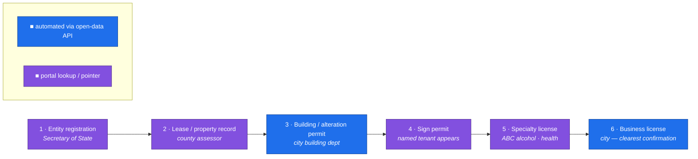
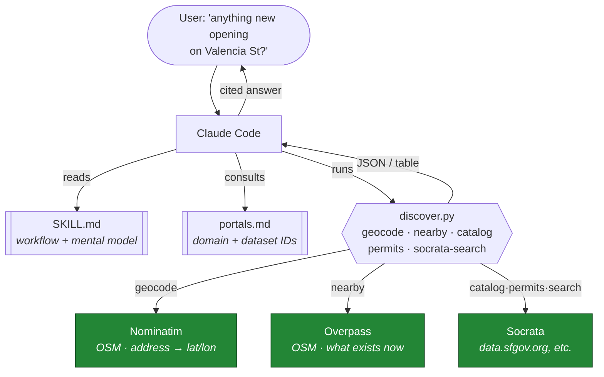
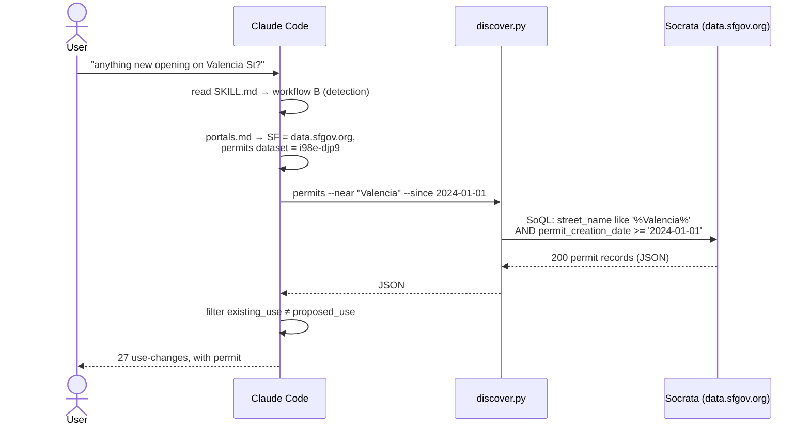
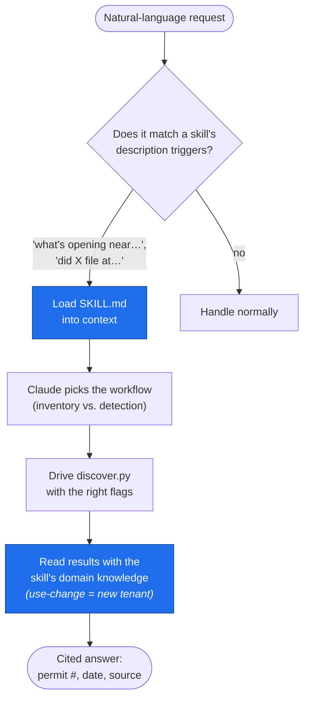

# Finding new businesses before they open: a Claude Code skill over public permit data

*How we built `discover-places` — a zero-API-key skill that answers "did a company file
to open at this address?" by reading the public paper trail that appears months before a
storefront does.*

---

## The problem

A map tells you what's **already open**. It can't tell you what's *about to* open. But a
new business leaves a public paper trail long before the doors do — an LLC registration,
a lease, a building permit, a sign permit, a liquor license, a business certificate.
Most of that is free and online. It's just scattered across a different portal in every
city, behind inconsistent schemas, and nobody wants to learn Socrata's SoQL dialect to
check whether the vacant retail space on their block is becoming a restaurant.

So we packaged the knowledge — *where to look, in what order, and how to read it* — into
a **Claude Code skill**. You ask in English; the skill drives a small CLI over open data
and reports the filings with citations.

The whole thing is standard-library Python, no API keys, no accounts.

---

## The core idea: a signal chain

New businesses emit public records in a rough order. Earlier signals give earlier
warning but weaker confidence; later ones confirm. The skill's mental model is this
chain:



**Earlier = earlier warning. Later = stronger confirmation.** The blue nodes (building
permits, business licenses) live on free **Socrata** open-data portals, so the skill
queries them directly. The purple nodes (SoS, property, ABC) are per-jurisdiction web
portals — the skill points you to the right one rather than pretending to automate it.

The single most useful automated signal is a **change-of-use building permit**: when a
space's `existing_use` differs from its `proposed_use` (e.g. `office → retail sales`, or
`retail sales → food/beverage`), someone is building out a new kind of tenant. That's
the needle we hunt for.

---

## Architecture

The skill is three files. `SKILL.md` is the instruction sheet Claude reads; `discover.py`
is a ~325-line CLI it drives; `portals.md` is the per-city lookup table. Everything talks
to three free upstreams.



Design constraints that shaped it:

- **No API keys.** Nominatim, Overpass, and Socrata all serve anonymous requests. The
  skill works the instant it's installed — no signup, no secrets to manage.
- **Standard library only.** `urllib` + `json` + `argparse`. Nothing to `pip install`,
  so the CLI can't rot when a dependency does.
- **Be a polite citizen.** Nominatim's policy is ~1 req/sec, so `geocode` sleeps. A
  descriptive `User-Agent` is set on every call (Overpass/Nominatim require it).
- **JSON by default, `--table` for humans.** Output pipes cleanly into `jq` or into the
  next step, and prints readably when a person wants to read it.

---

## The CLI

Five subcommands, each a thin wrapper over one upstream:

| Subcommand | Answers | Source |
|---|---|---|
| `geocode "<address>"` | address → lat/lon | Nominatim |
| `nearby --address … --category food` | what's physically open near me | Overpass |
| `catalog --domain … --query …` | which dataset holds permits here | Socrata |
| `permits --near <street> --since <date>` | **who filed to open here** | Socrata |
| `socrata-search --query "<company>"` | did *this company* register | Socrata |

The `permits` command is where the detection logic lives. It builds a SoQL `$where`
clause from friendly flags — `--near "Valencia"` becomes a case-insensitive `like`, and
`--since 2024-01-01` becomes a date filter on whatever `--date-col` the city uses:

```python
clauses = []
if args.near:
    safe = args.near.replace("'", "''")
    clauses.append(f"upper({args.address_col}) like upper('%{safe}%')")
if args.since:
    clauses.append(f"{args.date_col} >= '{args.since}'")
where = " AND ".join(clauses)
```

Column names differ per city — SF calls it `street_name` / `permit_creation_date`,
Chicago splits the street across three columns — so the flags are parameterized and the
skill instructs Claude to **inspect one raw record before filtering**. That's the kind of
judgment that lives in `SKILL.md`, not in the code.

---

## A real detection, end to end

Here's the actual sequence for *"Is anything new opening on Valencia St in San
Francisco?"* — every step ran against live data.



And a sample of what came back — real filings, real permit numbers:

| Address | Use change | Status | Filed | What |
|---|---|---|---|---|
| **724 Valencia** | `1 family dwelling → retail sales` | filed | 2025-11-24 | *"install new coffee service station (accessory to floral retail)…"* — a florist + coffee bar being built out. Permit `202511240359`, $25k. |
| **510 Valencia** | `retail sales → food/beverage` | issued | 2024-09-09 | *"existing vacant retail space to be converted into a restaurant."* $120k. |
| **1031 Valencia** | `office → retail sales` | issued | 2025-06-05 | *"change of use from … trade office to proposed retail store w/ service center."* $420k. |
| **309 Valencia** | `workshop → barber/beauty salon` | issued | 2025-03-10 | *"change of use from art gallery to nail salon."* |

None of these were on a map yet. All of them are on the public record. That's the thesis
working.

---

## Why a *skill* and not just a script

The CLI is the muscle; the skill is the judgment. A raw script needs you to already know
which portal, which dataset ID, which columns, and how to read a change-of-use. The skill
encodes all of that so a plain-English question resolves to the right calls.



The skill's `description` field is what makes Claude reach for it on *"is a new restaurant
opening at…"* without being told to. And crucially, `SKILL.md` carries the guardrails the
code can't: **verify, don't assert.** A permit is a filing, not a fact — permits get
withdrawn, licenses lapse. The skill reports the record and its date and lets *convergence
of signals* (permit + license + still-absent-from-OSM = "building out, not yet open")
drive any confidence, rather than declaring "a restaurant is opening here" off one row.

---

## Honest limits

- **SF is battle-tested; other cities are structurally ready.** NYC and Chicago have
  verified dataset IDs in `portals.md`, but the full detection pass has only been run
  live against San Francisco. New cities need a one-time column check.
- **Half the signal chain is pointers, not automation.** Secretary of State, county
  property/lease, and ABC (alcohol) records are mostly per-jurisdiction web portals. The
  skill routes you there — and can drive them with browser tools — but doesn't pretend
  the CLI queries them.
- **US-scoped.** Socrata + US SoS/ABC. International portals aren't covered.

---

## Try it

```bash
# What's already open near you
python3 scripts/discover.py nearby --address "Ferry Building, San Francisco" \
    --radius 400 --category food --table

# What's being built out on a street
python3 scripts/discover.py permits --domain data.sfgov.org --dataset i98e-djp9 \
    --address-col street_name --near "Valencia" --since 2024-01-01 --table
```

Or just install the skill and ask Claude Code: *"is anything new opening on my street?"*
The paper trail is public. Now it's one question away.
