# workspace
*Capturing my personal working environment*

My personal unix development environment.

### Setup Instructions:
* Change the Identitiy file in ssh/config and move it to .ssh/config
* Change the git/gitconfig files username and email and move it to ~/.gitconfig
* Change variables in the variables.sh file
* Add a line to ~/.bash_profile to source loader.sh


------------------------------------------
### Prerequisites
- virtualenvwrapper:
    - installation:
        1. Install virtual env: pip install virtualenvwrapper
        2. Create a directory to hold the virtual environments.
        3. Add a line like "export WORKON_HOME=<Virtual Envs Home>" to your .bashrc.
        4. source virtualenvwrapper

------------------------------------------
### ZSH Configuration Mechanisms

#### Sourcing Flow Diagram

The following diagram illustrates how configuration files are sourced during shell initialization:

```mermaid
flowchart TD
    A[.zshrc] --> B[loader.sh]
    B --> C[loader-personal.sh]
    B --> D[loader-shared.sh]
    
    C --> E[loader-variables.sh]
    E --> F[common.sh]
    E --> G[variables/icloud.sh]
    E --> H[variables/hardware.sh]
    E --> I[variables/dirs.sh]
    E --> J[variables/fzf.sh]
    E --> K[variables/ssh.sh]
    E --> L[variables/apps.sh]
    E --> M[variables/aws.sh]
    E --> N[variables/opts.sh]
    E --> O[variables/secrets.sh]
    E --> P[variables/path.sh]
    E --> Q[overrides/mac_id/variables.sh]
    
    C --> R[common.sh]
    C --> S[envmgr/envmgr.sh]
    C --> T[ifttt/maker.sh]
    C --> U[ifttt/functions.sh]
    C --> V[themes/theme.sh]
    C --> W[recursive_source functions-personal/]
    
    D --> X[loader-brew.sh]
    X --> Y[common.sh]
    X --> Z[recursive_source functions-completion/]
    X --> AA[recursive_source functions-extensions/]
    X --> AB[recursive_source functions-shortcuts/]
    X --> AC[recursive_source functions-tools/]
    
    style A fill:#e1f5ff
    style B fill:#b3e5fc
    style C fill:#81d4fa
    style D fill:#81d4fa
    style E fill:#4fc3f7
    style X fill:#4fc3f7
    style W fill:#29b6f6
    style Z fill:#29b6f6
    style AA fill:#29b6f6
    style AB fill:#29b6f6
    style AC fill:#29b6f6
```



The `profiles/zshrc` file sources multiple mechanisms in the following order:

#### 1. **Oh My Zsh Framework**
- Main framework: `source ${ZSH}/oh-my-zsh.sh`
- Theme: `robbyrussell`
- Plugins: git, docker, macos, brew, node, npm, python, zsh-completions, history

#### 2. **Main Workspace Loader** (`loader.sh`)
Sourced after Oh My Zsh (to avoid PS1 conflicts). This loads:
- **Personal Loader** (`loader-personal.sh`):
  - Variables loader (`loader-variables.sh`):
    - `common.sh` - Common utility functions
    - `variables/icloud.sh` - iCloud directory variables
    - `variables/hardware.sh` - Hardware-specific variables
    - `variables/dirs.sh` - Directory path variables
    - `variables/fzf.sh` - fzf configuration variables
    - `variables/ssh.sh` - SSH configuration variables
    - `variables/apps.sh` - Application path variables
    - `variables/aws.sh` - AWS configuration variables
    - `variables/opts.sh` - Option variables
    - `variables/secrets.sh` - Secret variables (loaded last)
    - `variables/path.sh` - PATH modifications
    - `overrides/{mac_id}/variables.sh` - Machine-specific overrides
  - `common.sh` - Common utility functions
  - `envmgr/envmgr.sh` - Environment manager
  - `ifttt/maker.sh` - IFTTT maker webhook functions
  - `ifttt/functions.sh` - IFTTT helper functions
  - `themes/theme.sh` - Terminal theme configuration
  - `functions-personal/` - All `.sh` files recursively sourced (personal functions)

- **Shared Loader** (`loader-shared.sh` → `loader-brew.sh`):
  - `common.sh` - Common utility functions
  - `functions-completion/` - All `.sh` files recursively sourced (completion functions)
  - `functions-extensions/` - All `.sh` files recursively sourced (extension functions)
  - `functions-shortcuts/` - All `.sh` files recursively sourced (shortcut/alias functions)
  - `functions-tools/` - All `.sh` files recursively sourced (tool functions)

#### 3. **Antigen Plugin Manager**
- Loads antigen from `~/.oh-my-zsh/plugins/antigen/antigen.zsh`
- Bundles:
  - `Tarrasch/zsh-autoenv` - Automatic environment activation
  - `zsh-users/zsh-syntax-highlighting` - Command syntax highlighting

#### 4. **Auto Jump**
- Sources `$(brew --prefix)/etc/profile.d/autojump.sh` if available
- Provides intelligent directory jumping

#### 5. **Career Workspace Functions** (Optional)
- Sources `workspace-career/functions.sh` and `workspace-career/aliases.sh` if directory exists

#### 6. **iTerm2 Integration**
- Sources iTerm2 shell integration script if available
- Enables iTerm2-specific features

#### 7. **ZSH Completion Scripts**
- Adds custom completion directories to `fpath`:
  - `functions-completion/zsh/`
  - `workspace-career/completion-functions/zsh/` (if exists)
- Rebuilds completion cache and initializes `compinit`

#### 8. **ASDF Version Manager**
- Sources `~/.asdf/asdf.sh` and completions if ASDF is installed
- Manages multiple runtime versions

#### 9. **Conda Environment**
- Initializes Conda via `conda init` hook
- Creates and activates default conda environment (`py3`)

#### 10. **NVM (Node Version Manager)**
- Sources NVM from brew prefix or `~/.nvm/nvm.sh`
- Installs and activates default NVM environment if not present

#### 11. **Docker CLI Completions**
- Adds Docker completions to `fpath`
- Reinitializes completions for Docker commands

#### 12. **Additional Configuration**
- Vi keybindings: `bindkey -v` (later overridden by `bindkey -e` for emacs mode)
- Completion menu: `zstyle ':completion:*' menu select`
- Custom function path: `fpath+=~/.zfunc`

##### Depricated
```
To create more functions and wrapper:
Create a file for each main function and place it in the functions dir.
Create a python file containing the possible choices for each command.
Import the newly created file and map it to a function that will return all possible choices when called in the __init__.py file's function_choices dict in the autocompleter dir.
```
-----------------------------------------------
