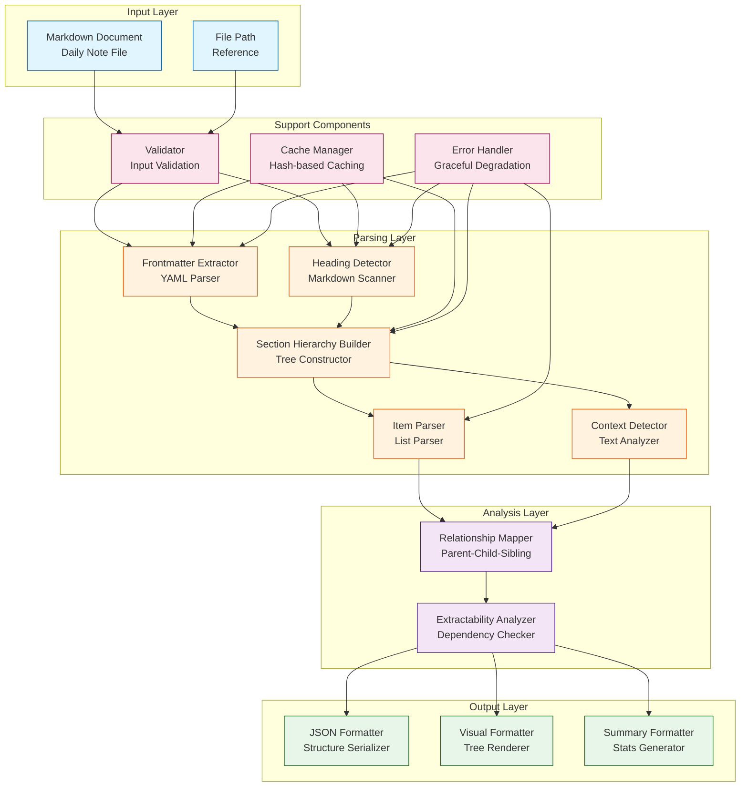
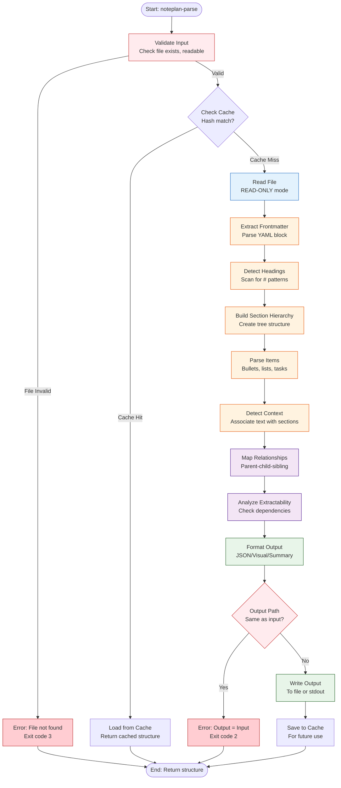
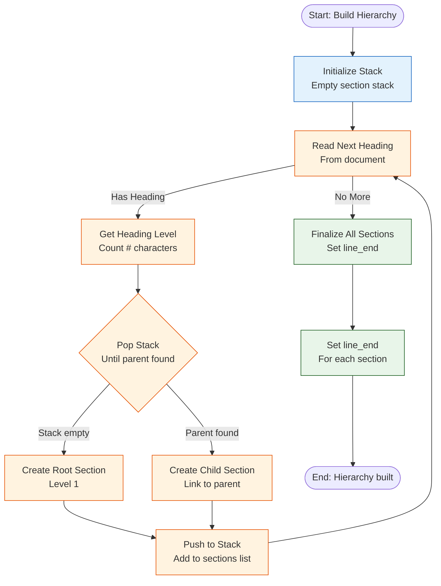
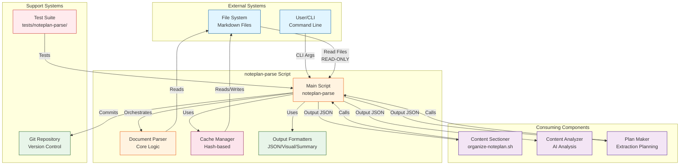
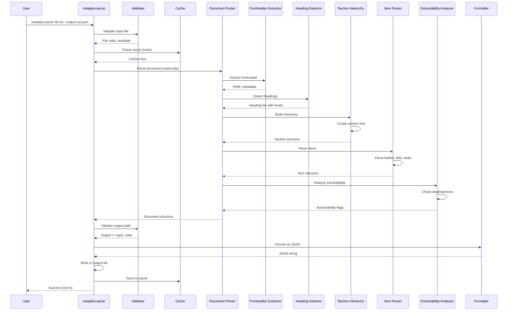
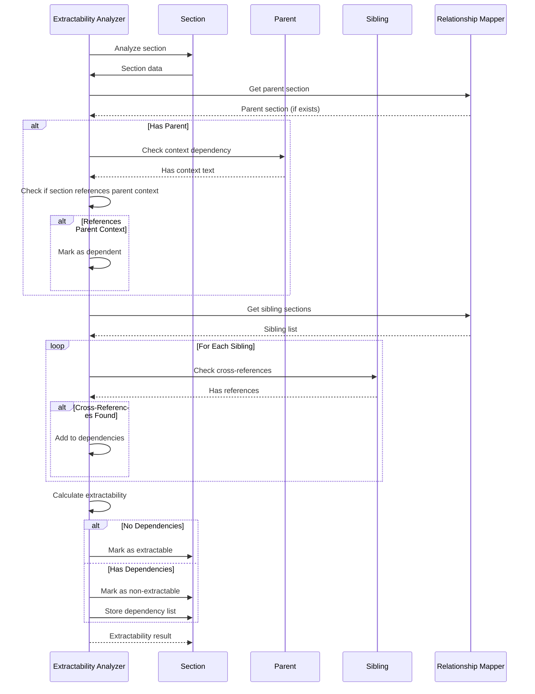
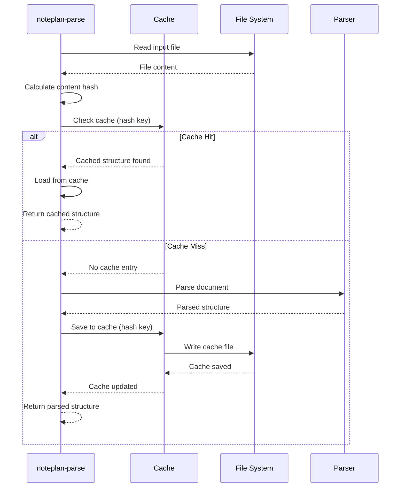

# Document Splitter Component - Detailed Design

**Author**: Engineering Team  
**Date**: 2025-01-XX  
**Status**: Detailed Design - Component Specification  
**Version**: 1.0  
**Parent Design**: `noteplan-organization.md`

## Overview

The Document Splitter is a critical component that parses markdown documents (daily notes) into a structured hierarchy of sections, subsections, and items. It enables the organization system to identify extractable content units and understand document structure for intelligent content extraction.

**Critical Safety Requirement**: The Document Splitter is **READ-ONLY**. It only reads documents and never modifies or writes to source files. All output goes to separate files (JSON, visual representations) or stdout. Source documents remain completely unchanged.

## Problem Statement

Daily notes contain mixed content organized in markdown format:
- Frontmatter (YAML metadata block)
- Multiple top-level headings (`# Heading`)
- Subheadings (`## Subheading`, `### Sub-subheading`)
- Bullet point lists under headings
- Indented items/subtasks under bullet points
- Context text between items

**Challenge**: Need to parse this structure to:
1. Identify logical content boundaries (what can be extracted together)
2. Understand hierarchical relationships (section → subsection → item)
3. Detect when splitting a subsection would break context
4. Enable easy review of what can be moved

## Document Structure Model

### Example Daily Note Structure

```markdown
---
title: "Daily Notes - 2025-01-13"
tags: [work, personal]
---

# Work

## Project X Planning Meeting

Discussed roadmap for Q2:
- Feature A: High priority
  - Design mockups needed
  - Engineering estimate: 2 weeks
- Feature B: Deferred
  - Waiting on stakeholder feedback

## Project Y Review

Status update:
- Sprint planning complete
- Blockers identified

# Personal

## Todos

- [ ] Buy groceries
  - Milk
  - Bread
- [ ] Call dentist
  - Schedule cleaning
  - Ask about insurance

## Ideas

Random thought about productivity...
```

### Parsed Structure

```json
{
  "document": {
    "path": "Calendar/20250113.txt",
    "frontmatter": {
      "title": "Daily Notes - 2025-01-13",
      "tags": ["work", "personal"]
    },
    "sections": [
      {
        "id": "sect-001",
        "level": 1,
        "heading": "# Work",
        "line_start": 6,
        "line_end": 20,
        "subsections": [
          {
            "id": "subsect-001",
            "level": 2,
            "heading": "## Project X Planning Meeting",
            "line_start": 8,
            "line_end": 15,
            "items": [
              {
                "id": "item-001",
                "type": "bullet",
                "content": "Feature A: High priority",
                "line_start": 10,
                "line_end": 12,
                "indented_items": [
                  {
                    "id": "item-001-1",
                    "type": "bullet",
                    "content": "Design mockups needed",
                    "line_start": 11,
                    "indent_level": 2
                  },
                  {
                    "id": "item-001-2",
                    "type": "bullet",
                    "content": "Engineering estimate: 2 weeks",
                    "line_start": 12,
                    "indent_level": 2
                  }
                ]
              },
              {
                "id": "item-002",
                "type": "bullet",
                "content": "Feature B: Deferred",
                "line_start": 13,
                "line_end": 14,
                "indented_items": [
                  {
                    "id": "item-002-1",
                    "type": "bullet",
                    "content": "Waiting on stakeholder feedback",
                    "line_start": 14,
                    "indent_level": 2
                  }
                ]
              }
            ],
            "context": "Discussed roadmap for Q2:"
          }
        ]
      }
    ]
  }
}
```

## Component Architecture

### Architecture Diagram



### Input
- Markdown document (daily note file) - **READ-ONLY**
- File path for reference

### Output
- Structured JSON representation of document hierarchy
- Section/subsection/item boundaries with line numbers
- Relationship mapping (parent-child, sibling relationships)
- Extractability flags (can this be moved independently?)

### Processing Steps

1. **Frontmatter Extraction**
   - Detect YAML frontmatter block (`---` delimiters)
   - Parse YAML content
   - Store separately from markdown content

2. **Heading Detection**
   - Scan for markdown headings (`# Heading`, `## Subheading`, etc.)
   - Track heading levels (1-6)
   - Record line numbers

3. **Section Hierarchy Building**
   - Build tree structure based on heading levels
   - Parent-child relationships: level 1 → level 2 → level 3
   - Sibling relationships: same level, sequential

4. **Content Assignment**
   - Assign content between headings to appropriate sections
   - Handle:
     - Paragraphs before first heading
     - Paragraphs between headings
     - Lists under headings
     - Indented content

5. **Item Parsing**
   - Identify bullet points (`-`, `*`, `+`)
   - Identify numbered lists
   - Identify task items (`- [ ]`, `- [x]`)
   - Track indentation levels
   - Parse indented sub-items

6. **Context Detection**
   - Identify context text (non-list content)
   - Associate context with nearest heading/item
   - Detect when context is shared across items

7. **Extractability Analysis**
   - Determine if section can be extracted independently
   - Check dependencies:
     - Does it reference parent section context?
     - Are there cross-references to other sections?
     - Would extraction break document flow?

## Data Structures

### Section Node

```typescript
interface SectionNode {
  id: string;                    // Unique identifier
  level: number;                 // Heading level (1-6)
  heading: string;              // Full heading text with markers
  heading_text: string;         // Heading text without markers
  line_start: number;            // Starting line number
  line_end: number;              // Ending line number
  content_start: number;         // First content line (after heading)
  content_end: number;           // Last content line
  parent_id: string | null;      // Parent section ID
  children: string[];            // Child section IDs
  items: ItemNode[];             // Items under this section
  context: string | null;        // Context text before items
  extractable: boolean;          // Can this be extracted independently?
  extraction_dependencies: string[]; // IDs of sections that must be extracted together
}
```

### Item Node

```typescript
interface ItemNode {
  id: string;                    // Unique identifier
  type: "bullet" | "numbered" | "task" | "paragraph";
  content: string;               // Item content
  line_start: number;            // Starting line number
  line_end: number;              // Ending line number
  indent_level: number;          // Indentation level (0 = top level)
  parent_item_id: string | null; // Parent item ID (for nested items)
  children: string[];            // Child item IDs
  context: string | null;        // Context text associated with item
  extractable: boolean;          // Can this item be extracted independently?
}
```

### Document Structure

```typescript
interface DocumentStructure {
  path: string;
  frontmatter: Record<string, any> | null;
  sections: SectionNode[];
  items: ItemNode[];            // Flat list of all items
  metadata: {
    total_lines: number;
    total_sections: number;
    total_items: number;
    parse_timestamp: string;
    parser_version: string;
  };
}
```

## Activity Diagram

### Document Parsing Flow



### Section Hierarchy Building Flow



## Parsing Algorithm

### Phase 1: Lexical Analysis

```python
def parse_markdown(document: str) -> DocumentStructure:
    lines = document.split('\n')
    
    # Extract frontmatter
    frontmatter, content_start = extract_frontmatter(lines)
    
    # Build heading map
    headings = detect_headings(lines, content_start)
    
    # Build section hierarchy
    sections = build_section_hierarchy(headings, lines)
    
    # Parse items within sections
    for section in sections:
        section.items = parse_items_in_section(section, lines)
        section.context = extract_context(section, lines)
    
    # Analyze extractability
    analyze_extractability(sections)
    
    return DocumentStructure(
        frontmatter=frontmatter,
        sections=sections,
        items=flatten_items(sections),
        metadata=compute_metadata(lines, sections)
    )
```

### Phase 2: Hierarchy Building

```python
def build_section_hierarchy(headings: List[Heading], lines: List[str]) -> List[SectionNode]:
    stack = []  # Stack of parent sections
    sections = []
    
    for heading in headings:
        # Pop stack until we find parent at correct level
        while stack and stack[-1].level >= heading.level:
            stack.pop()
        
        section = SectionNode(
            id=f"sect-{len(sections):03d}",
            level=heading.level,
            heading=heading.full_text,
            heading_text=heading.text,
            line_start=heading.line_number,
            parent_id=stack[-1].id if stack else None
        )
        
        if stack:
            stack[-1].children.append(section.id)
        
        stack.append(section)
        sections.append(section)
    
    # Set line_end for each section
    for i, section in enumerate(sections):
        if i + 1 < len(sections):
            section.line_end = sections[i + 1].line_start - 1
        else:
            section.line_end = len(lines)
    
    return sections
```

### Phase 3: Item Parsing

```python
def parse_items_in_section(section: SectionNode, lines: List[str]) -> List[ItemNode]:
    items = []
    current_item = None
    
    for line_num in range(section.content_start, section.content_end + 1):
        line = lines[line_num]
        indent = get_indent_level(line)
        
        if is_bullet_point(line):
            # New top-level item
            if current_item:
                items.append(current_item)
            
            current_item = ItemNode(
                id=f"item-{section.id}-{len(items):03d}",
                type=detect_item_type(line),
                content=extract_item_content(line),
                line_start=line_num,
                indent_level=indent
            )
        elif is_indented_content(line, current_item):
            # Sub-item or context
            if is_bullet_point(line):
                sub_item = ItemNode(
                    id=f"item-{current_item.id}-{len(current_item.children):03d}",
                    type=detect_item_type(line),
                    content=extract_item_content(line),
                    line_start=line_num,
                    indent_level=indent,
                    parent_item_id=current_item.id
                )
                current_item.children.append(sub_item.id)
            else:
                # Context text
                if not current_item.context:
                    current_item.context = ""
                current_item.context += line.strip() + "\n"
        elif line.strip():
            # Paragraph context
            if not section.context:
                section.context = ""
            section.context += line.strip() + "\n"
    
    if current_item:
        items.append(current_item)
    
    return items
```

### Phase 4: Extractability Analysis

```python
def analyze_extractability(sections: List[SectionNode]) -> None:
    for section in sections:
        # Check if section has dependencies
        dependencies = []
        
        # Check parent context dependency
        if section.parent_id:
            parent = find_section(section.parent_id, sections)
            if parent.context and section.references_parent_context():
                dependencies.append(section.parent_id)
        
        # Check sibling dependencies
        siblings = get_siblings(section, sections)
        for sibling in siblings:
            if section.cross_references(sibling):
                dependencies.append(sibling.id)
        
        section.extraction_dependencies = dependencies
        section.extractable = len(dependencies) == 0
```

## Extraction Unit Identification

### Extraction Units

The parser identifies different levels of extractable units:

1. **Full Section** (Level 1 heading + all children)
   - Example: Entire "# Work" section
   - Extractable if: No dependencies on other sections

2. **Subsection** (Level 2+ heading + children)
   - Example: "## Project X Planning Meeting"
   - Extractable if: No dependencies on parent section context

3. **Item Group** (Multiple related items)
   - Example: All items under a subsection
   - Extractable if: Items are logically grouped

4. **Individual Item** (Single bullet point + children)
   - Example: "Feature A: High priority" + sub-items
   - Extractable if: Item is self-contained

### Extraction Rules

```python
def identify_extraction_units(section: SectionNode) -> List[ExtractionUnit]:
    units = []
    
    # Check if entire section is extractable
    if section.extractable:
        units.append(ExtractionUnit(
            type="full_section",
            section_id=section.id,
            content_lines=(section.line_start, section.line_end)
        ))
    
    # Check subsections
    for child_id in section.children:
        child = find_section(child_id, sections)
        if child.extractable:
            units.append(ExtractionUnit(
                type="subsection",
                section_id=child.id,
                content_lines=(child.line_start, child.line_end)
            ))
    
    # Check item groups
    item_groups = group_related_items(section.items)
    for group in item_groups:
        if is_extractable_group(group):
            units.append(ExtractionUnit(
                type="item_group",
                item_ids=[item.id for item in group],
                content_lines=(group[0].line_start, group[-1].line_end)
            ))
    
    return units
```

## Review Interface

### Visual Representation

For review, the parser generates a visual representation:

```markdown
📄 Calendar/20250113.txt

┌─ # Work [sect-001] ✅ Extractable
│  └─ ## Project X Planning Meeting [subsect-001] ✅ Extractable
│     ├─ 📝 Context: "Discussed roadmap for Q2:"
│     ├─ • Feature A: High priority [item-001] ✅ Extractable
│     │  ├─ • Design mockups needed [item-001-1]
│     │  └─ • Engineering estimate: 2 weeks [item-001-2]
│     └─ • Feature B: Deferred [item-002] ✅ Extractable
│        └─ • Waiting on stakeholder feedback [item-002-1]
│
└─ # Personal [sect-002] ✅ Extractable
   └─ ## Todos [subsect-002] ✅ Extractable
      ├─ • [ ] Buy groceries [item-003] ✅ Extractable
      │  ├─ • Milk [item-003-1]
      │  └─ • Bread [item-003-2]
      └─ • [ ] Call dentist [item-004] ✅ Extractable
         └─ • Schedule cleaning [item-004-1]
```

### Extraction Preview

When reviewing, show what will be extracted:

```json
{
  "extraction_unit": {
    "type": "subsection",
    "id": "subsect-001",
    "heading": "## Project X Planning Meeting",
    "content_preview": "Discussed roadmap for Q2:\n- Feature A: High priority\n  - Design mockups needed\n  - Engineering estimate: 2 weeks\n- Feature B: Deferred\n  - Waiting on stakeholder feedback",
    "line_range": [8, 15],
    "target_bucket": "Notes/Projects/Work/ProjectX/meetings.txt",
    "dependencies": [],
    "will_split_from": "sect-001"  // Parent section
  }
}
```

## Implementation Details

### Script Location and Naming

- **Script Path**: `/Users/omareid/Workspace/git/workspace/scripts/noteplan-parse`
- **Script Name**: `noteplan-parse`
- **Executable**: Should be executable (`chmod +x`) and have shebang (`#!/usr/bin/env python3`)
- **Integration**: Used by `organize-noteplan.sh` and other organization scripts

### Read-Only Operation (Critical)

**The `noteplan-parse` script is READ-ONLY and must NEVER modify source documents.**

**What it DOES**:
- ✅ Reads markdown document files
- ✅ Parses document structure
- ✅ Outputs JSON to stdout or specified output file
- ✅ Outputs visual representations to stdout
- ✅ Writes cache files (if caching enabled)
- ✅ Writes parsed output to separate files (if `--output` specified)

**What it DOES NOT do**:
- ❌ Modify source document files
- ❌ Write to source document files
- ❌ Delete source document files
- ❌ Rename source document files
- ❌ Add content to source document files
- ❌ Remove content from source document files
- ❌ Change file permissions or metadata

**Safety Guarantees**:
- Source files are opened in read-only mode
- No write operations to source file paths
- All output goes to separate locations (stdout, output files, cache)
- Script validates it's not being asked to write to source file location

### Technology Stack

- **Language**: Python 3 (for parsing logic)
- **Markdown Parser**: `markdown` library or custom parser
- **YAML Parser**: `pyyaml` for frontmatter
- **Output Format**: JSON for structured data
- **Dependencies**: 
  - `pyyaml` (for frontmatter parsing)
  - `markdown` or custom markdown parser
  - Standard library: `json`, `sys`, `argparse`, `re`

### Command-Line Interface

**Basic Usage**:
```bash
# Parse a single document
noteplan-parse Calendar/20250113.txt

# Parse and output to file
noteplan-parse Calendar/20250113.txt --output analysis/parsed-20250113.json

# Parse with specific options
noteplan-parse Calendar/20250113.txt --format json --include-extractability

# Parse multiple files
noteplan-parse Calendar/*.txt --output-dir analysis/parsed/

# Show visual tree structure
noteplan-parse Calendar/20250113.txt --visual

# Show only extractable units
noteplan-parse Calendar/20250113.txt --extractable-only
```

**Command-Line Arguments**:
```bash
noteplan-parse [OPTIONS] FILE...

Options:
  --output, -o FILE          Output JSON to file (default: stdout)
                              NOTE: Cannot be same as input file (safety check)
  --output-dir DIR            Output directory for multiple files
  --format FORMAT             Output format: json, visual, summary (default: json)
  --include-extractability    Include extractability analysis in output
  --extractable-only          Show only extractable units
  --visual, -v                Show visual tree structure
  --summary, -s               Show summary statistics only
  --cache-dir DIR             Directory for caching parsed structures
  --no-cache                  Disable caching
  --verbose                   Verbose output
  --help, -h                  Show help message

Safety:
  - Script will error if --output points to an input file
  - Script only opens input files in read-only mode
  - All writes go to separate output locations
```

**Exit Codes**:
- `0`: Success
- `1`: Error parsing document
- `2`: Invalid arguments
- `3`: File not found

### Script Structure

```python
#!/usr/bin/env python3
"""
noteplan-parse - Parse NotePlan markdown documents into structured hierarchy

Usage:
    noteplan-parse [OPTIONS] FILE...

This script parses markdown documents (daily notes) into a structured
hierarchy of sections, subsections, and items. It identifies extractable
content units and their dependencies.

CRITICAL: This script is READ-ONLY. It never modifies source files.
All output goes to separate files or stdout.

See: docs/plans/document-splitter-design.md for full specification.
"""

import sys
import argparse
import json
from pathlib import Path

# Import parsing modules
from noteplan_parser import DocumentParser
from noteplan_parser import extractability_analyzer
from noteplan_parser import visual_formatter

def validate_output_path(output_path, input_files):
    """Safety check: ensure output is not an input file."""
    if output_path:
        output_path = Path(output_path).resolve()
        for input_file in input_files:
            input_path = Path(input_file).resolve()
            if output_path == input_path:
                print(f"ERROR: Output file cannot be same as input file: {input_path}", 
                      file=sys.stderr)
                sys.exit(2)
    return True

def read_document(file_path):
    """Read document in read-only mode."""
    try:
        with open(file_path, 'r', encoding='utf-8') as f:
            return f.read()
    except IOError as e:
        print(f"ERROR: Cannot read file {file_path}: {e}", file=sys.stderr)
        sys.exit(1)

def main():
    parser = argparse.ArgumentParser(
        description='Parse NotePlan markdown documents into structured hierarchy (READ-ONLY)',
        formatter_class=argparse.RawDescriptionHelpFormatter,
        epilog='See docs/plans/document-splitter-design.md for full specification.'
    )
    
    parser.add_argument('files', nargs='+', help='Input markdown files to parse')
    parser.add_argument('--output', '-o', help='Output JSON file (default: stdout)')
    # ... other arguments ...
    
    args = parser.parse_args()
    
    # Safety check: output cannot be an input file
    if args.output:
        validate_output_path(args.output, args.files)
    
    # Process files (read-only)
    for file_path in args.files:
        content = read_document(file_path)  # Read-only
        # Parse content...
        # Output to separate file or stdout (never modify source)
    
    return 0

if __name__ == '__main__':
    sys.exit(main())
```

### Output Formats

**JSON Format** (default):
```json
{
  "document": {
    "path": "Calendar/20250113.txt",
    "frontmatter": {...},
    "sections": [...],
    "metadata": {...}
  }
}
```

**Visual Format** (`--visual`):
```
📄 Calendar/20250113.txt

┌─ # Work [sect-001] ✅ Extractable
│  └─ ## Project X Planning Meeting [subsect-001] ✅ Extractable
│     ├─ 📝 Context: "Discussed roadmap for Q2:"
│     ├─ • Feature A: High priority [item-001] ✅ Extractable
│     │  ├─ • Design mockups needed [item-001-1]
│     │  └─ • Engineering estimate: 2 weeks [item-001-2]
...
```

**Summary Format** (`--summary`):
```
Document: Calendar/20250113.txt
Total Sections: 2
Total Subsections: 3
Total Items: 8
Extractable Units: 5
Dependencies: 0
```

### Integration with Other Scripts

**Used by `organize-noteplan.sh`**:
```bash
# In organize-noteplan.sh
for note in "${DAILY_NOTES[@]}"; do
    # Parse document structure
    noteplan-parse "${note}" --output "${TMPDIR}/parsed-$(basename ${note}).json"
    
    # Process parsed structure
    jq -r '.document.sections[] | select(.extractable) | .id' \
        "${TMPDIR}/parsed-$(basename ${note}).json"
done
```

**Used by Content Sectioner**:
```bash
# Parse and get extractable sections
EXTRACTABLE=$(noteplan-parse "${NOTE_FILE}" --extractable-only --format json)
```

### Performance Considerations

- **Caching**: Cache parsed structures (hash-based) in `~/.cache/noteplan-parse/` or specified `--cache-dir`
  - Cache key: `sha256(file_path + file_content_hash)`
  - Cache format: JSON files
  - Cache invalidation: On file modification time change
- **Incremental Parsing**: Only re-parse changed sections (if file hash matches, use cache)
- **Lazy Evaluation**: Don't parse full document if only checking structure (`--summary` mode)
- **Batch Processing**: Process multiple files efficiently (reuse parser state)

### Error Handling

- **Malformed Markdown**: Graceful degradation, report issues in output
  - Continue parsing, mark problematic sections
  - Include warnings in output JSON: `"warnings": ["Unclosed heading at line 42"]`
  - **Never modify source file** to fix issues
- **Unclosed Sections**: Infer boundaries from context (read-only)
- **Invalid Indentation**: Normalize in memory only, warn in output (never modify source)
- **Missing Files**: Clear error message, exit code 3
- **Invalid Arguments**: Helpful error message, exit code 2
- **Output Safety**: Error if output path is same as input file (prevents accidental overwrite)

### Configuration

**Default Configuration** (can be overridden via environment variables or config file):
- Cache directory: `~/.cache/noteplan-parse/`
- Max section depth: 6 (markdown heading levels)
- Extractability rules: See `extractability_analyzer` module
- Indentation detection: Spaces (2 or 4) or tabs

**Configuration File** (optional, `~/.noteplan-parse.conf` or `./.noteplan-parse.conf`):
```yaml
cache:
  enabled: true
  directory: ~/.cache/noteplan-parse/
  ttl: 3600  # seconds

parsing:
  max_depth: 6
  normalize_indentation: true
  detect_context: true

extractability:
  require_no_dependencies: true
  check_cross_references: true
```

### Testing

**See "Testing Strategy" section below for complete test implementation details.**

Quick test example:
```bash
# Run all tests
tests/noteplan-parse/test-noteplan-parse.sh

# Test parsing a single document
noteplan-parse tests/noteplan-parse/fixtures/simple-daily-note.txt \
    --output /tmp/test-output.json

# Verify output structure
jq '.document.sections | length' /tmp/test-output.json
```

## Testing Strategy

### Test Location

- **Test Directory**: `/Users/omareid/Workspace/git/workspace/tests/noteplan-parse/`
- **Test Script**: `/Users/omareid/Workspace/git/workspace/tests/noteplan-parse/test-noteplan-parse.sh`
- **Test Fixtures**: `/Users/omareid/Workspace/git/workspace/tests/noteplan-parse/fixtures/`
- **Test Output**: `/Users/omareid/Workspace/git/workspace/tests/noteplan-parse/output/` (temporary, gitignored)

### Test Structure

```
tests/noteplan-parse/
├── test-noteplan-parse.sh          # Main test runner
├── fixtures/                        # Sample markdown files
│   ├── simple-daily-note.txt       # Basic structure
│   ├── nested-sections.txt         # Multiple heading levels
│   ├── with-frontmatter.txt        # YAML frontmatter
│   ├── mixed-content.txt          # Various content types
│   ├── malformed-markdown.txt     # Edge cases
│   ├── empty-sections.txt         # Empty sections
│   ├── complex-hierarchy.txt      # Deep nesting
│   ├── task-items.txt             # Task lists
│   ├── numbered-lists.txt         # Numbered lists
│   └── cross-references.txt       # Sections with links
├── expected/                       # Expected output JSON
│   ├── simple-daily-note.json
│   ├── nested-sections.json
│   └── ...
└── output/                         # Actual test output (gitignored)
    └── .gitignore                  # Ignore all output files
```

**Note**: The `output/` directory should be gitignored. Add to `.gitignore`:
```
tests/noteplan-parse/output/
```

### Unit Tests

**Test Categories**:

1. **Basic Parsing Tests**
   - Parse simple document with one section
   - Parse document with nested sections (2-6 levels)
   - Parse document with frontmatter (YAML)
   - Parse document with mixed content types

2. **Content Type Tests**
   - Bullet point lists
   - Numbered lists
   - Task items (`- [ ]`, `- [x]`)
   - Mixed list types
   - Indented sub-items

3. **Edge Case Tests**
   - Empty sections
   - Malformed markdown
   - Unclosed headings
   - Invalid indentation
   - Missing frontmatter
   - Empty documents
   - Documents with only frontmatter

4. **Extractability Tests**
   - Sections with no dependencies
   - Sections with parent dependencies
   - Sections with sibling dependencies
   - Cross-referenced sections
   - Isolated extractable units

5. **Read-Only Safety Tests**
   - Verify source files unchanged after parsing
   - Verify file modification times unchanged
   - Verify file content hash unchanged
   - Verify error when output path is input file
   - Verify no write operations to source files

### Test Fixtures (Sample Markdown Files)

**1. Simple Daily Note** (`fixtures/simple-daily-note.txt`):
```markdown
# Work

## Project X

- Task 1
- Task 2
```

**2. Nested Sections** (`fixtures/nested-sections.txt`):
```markdown
# Level 1

## Level 2

### Level 3

#### Level 4

##### Level 5

###### Level 6
```

**3. With Frontmatter** (`fixtures/with-frontmatter.txt`):
```markdown
---
title: "Daily Notes"
tags: [work, personal]
date: 2025-01-13
---

# Content

Some content here.
```

**4. Mixed Content** (`fixtures/mixed-content.txt`):
```markdown
# Work

## Meeting Notes

Discussed project status:
- Feature A: Complete
  - Tests passing
  - Documentation done
- Feature B: In progress
  - Code review pending

## Todos

- [ ] Review PR
- [x] Update docs
- [ ] Deploy to staging
```

**5. Malformed Markdown** (`fixtures/malformed-markdown.txt`):
```markdown
# Unclosed heading
## Missing content

- Incomplete list
```

**6. Complex Hierarchy** (`fixtures/complex-hierarchy.txt`):
```markdown
# Section 1

## Subsection 1.1

### Item 1.1.1
- Sub-item
  - Sub-sub-item

## Subsection 1.2

# Section 2

## Subsection 2.1
```

**7. Task Items** (`fixtures/task-items.txt`):
```markdown
# Tasks

## Personal
- [ ] Buy groceries
  - [ ] Milk
  - [ ] Bread
- [x] Call dentist

## Work
- [ ] Review code
- [ ] Write tests
```

**8. Cross-References** (`fixtures/cross-references.txt`):
```markdown
# Work

## Project A
See [[Project B]] for details.

## Project B
Related to Project A above.
```

### Test Script Implementation

**Main Test Runner** (`tests/noteplan-parse/test-noteplan-parse.sh`):

```bash
#!/bin/bash
# test-noteplan-parse.sh - Test suite for noteplan-parse script

set -e

SCRIPT_DIR="$( cd "$( dirname "${BASH_SOURCE[0]}" )" && pwd )"
WORKSPACE_DIR="$(dirname "$(dirname "$SCRIPT_DIR")")"
NOTEPLAN_PARSE="${WORKSPACE_DIR}/scripts/noteplan-parse"
FIXTURES_DIR="${SCRIPT_DIR}/fixtures"
EXPECTED_DIR="${SCRIPT_DIR}/expected"
OUTPUT_DIR="${SCRIPT_DIR}/output"
TEMP_DIR=$(mktemp -d)

# Colors for output
RED='\033[0;31m'
GREEN='\033[0;32m'
YELLOW='\033[1;33m'
NC='\033[0m' # No Color

# Cleanup
trap "rm -rf ${TEMP_DIR}" EXIT

# Create output directory
mkdir -p "${OUTPUT_DIR}"

# Test counter
TESTS_PASSED=0
TESTS_FAILED=0

test_parse() {
    local fixture="$1"
    local test_name="$2"
    local expected_file="${EXPECTED_DIR}/$(basename ${fixture} .txt).json"
    local output_file="${OUTPUT_DIR}/$(basename ${fixture} .txt).json"
    
    echo -n "Testing ${test_name}... "
    
    # Run parser
    if ! "${NOTEPLAN_PARSE}" "${fixture}" --output "${output_file}" > /dev/null 2>&1; then
        echo -e "${RED}FAILED${NC} (parser error)"
        ((TESTS_FAILED++))
        return 1
    fi
    
    # Compare with expected (if exists)
    if [ -f "${expected_file}" ]; then
        if ! diff -q "${expected_file}" "${output_file}" > /dev/null; then
            echo -e "${RED}FAILED${NC} (output mismatch)"
            echo "  Expected: ${expected_file}"
            echo "  Actual: ${output_file}"
            ((TESTS_FAILED++))
            return 1
        fi
    fi
    
    echo -e "${GREEN}PASSED${NC}"
    ((TESTS_PASSED++))
    return 0
}

test_readonly() {
    local fixture="$1"
    local test_name="$2"
    local original_hash=$(sha256sum "${fixture}" | cut -d' ' -f1)
    local original_mtime=$(stat -f %m "${fixture}" 2>/dev/null || stat -c %Y "${fixture}")
    
    echo -n "Testing read-only: ${test_name}... "
    
    # Run parser
    "${NOTEPLAN_PARSE}" "${fixture}" --output "${TEMP_DIR}/output.json" > /dev/null 2>&1
    
    # Check file unchanged
    local new_hash=$(sha256sum "${fixture}" | cut -d' ' -f1)
    local new_mtime=$(stat -f %m "${fixture}" 2>/dev/null || stat -c %Y "${fixture}")
    
    if [ "${original_hash}" != "${new_hash}" ]; then
        echo -e "${RED}FAILED${NC} (file content changed)"
        ((TESTS_FAILED++))
        return 1
    fi
    
    if [ "${original_mtime}" != "${new_mtime}" ]; then
        echo -e "${YELLOW}WARNING${NC} (modification time changed, but content OK)"
    fi
    
    echo -e "${GREEN}PASSED${NC}"
    ((TESTS_PASSED++))
    return 0
}

test_output_safety() {
    local fixture="$1"
    local test_name="$2"
    
    echo -n "Testing output safety: ${test_name}... "
    
    # Try to output to input file (should fail)
    if "${NOTEPLAN_PARSE}" "${fixture}" --output "${fixture}" > /dev/null 2>&1; then
        echo -e "${RED}FAILED${NC} (allowed output to input file)"
        ((TESTS_FAILED++))
        return 1
    fi
    
    echo -e "${GREEN}PASSED${NC}"
    ((TESTS_PASSED++))
    return 0
}

# Run tests
echo "Running noteplan-parse tests..."
echo ""

# Basic parsing tests
test_parse "${FIXTURES_DIR}/simple-daily-note.txt" "Simple daily note"
test_parse "${FIXTURES_DIR}/nested-sections.txt" "Nested sections"
test_parse "${FIXTURES_DIR}/with-frontmatter.txt" "With frontmatter"
test_parse "${FIXTURES_DIR}/mixed-content.txt" "Mixed content"
test_parse "${FIXTURES_DIR}/task-items.txt" "Task items"

# Read-only safety tests
test_readonly "${FIXTURES_DIR}/simple-daily-note.txt" "Simple daily note"
test_readonly "${FIXTURES_DIR}/mixed-content.txt" "Mixed content"

# Output safety tests
test_output_safety "${FIXTURES_DIR}/simple-daily-note.txt" "Output to input file"

# Summary
echo ""
echo "========================================="
echo "Tests passed: ${TESTS_PASSED}"
echo "Tests failed: ${TESTS_FAILED}"
echo "========================================="

if [ ${TESTS_FAILED} -eq 0 ]; then
    exit 0
else
    exit 1
fi
```

### Integration Tests

- Parse real daily notes from repository (if available)
- Verify extraction units are correctly identified
- Verify dependencies are correctly detected
- Verify review interface shows correct structure
- Performance tests with large documents

### Git Hook for Pre-Commit Testing

**Hook Location**: `.git/hooks/pre-commit`

**Hook Implementation** (`setup/git-hooks/pre-commit-noteplan-parse`):

```bash
#!/bin/bash
# pre-commit hook to run noteplan-parse tests

WORKSPACE_DIR="$(git rev-parse --show-toplevel)"
TEST_SCRIPT="${WORKSPACE_DIR}/tests/noteplan-parse/test-noteplan-parse.sh"

# Check if noteplan-parse script exists
if [ ! -f "${WORKSPACE_DIR}/scripts/noteplan-parse" ]; then
    exit 0  # Script doesn't exist yet, skip tests
fi

# Check if test script exists
if [ ! -f "${TEST_SCRIPT}" ]; then
    exit 0  # Tests don't exist yet, skip
fi

# Check if any scripts or tests were modified
if git diff --cached --name-only | grep -E "(scripts/noteplan-parse|tests/noteplan-parse)" > /dev/null; then
    echo "Running noteplan-parse tests..."
    if ! "${TEST_SCRIPT}"; then
        echo "ERROR: noteplan-parse tests failed. Commit aborted."
        echo "Fix the tests or use 'git commit --no-verify' to skip (not recommended)."
        exit 1
    fi
    echo "noteplan-parse tests passed."
fi

exit 0
```

**Setup Script** (`setup/setup-git-hooks.sh`):

```bash
#!/bin/bash
# Setup git hooks for noteplan-parse testing

WORKSPACE_DIR="$( cd "$( dirname "${BASH_SOURCE[0]}" )" && cd .. && pwd )"
GIT_HOOKS_DIR="${WORKSPACE_DIR}/.git/hooks"
PRE_COMMIT_HOOK="${GIT_HOOKS_DIR}/pre-commit"
HOOK_SOURCE="${WORKSPACE_DIR}/setup/git-hooks/pre-commit-noteplan-parse"

# Create hooks directory if it doesn't exist
mkdir -p "${GIT_HOOKS_DIR}"

# Install pre-commit hook
if [ -f "${HOOK_SOURCE}" ]; then
    # Append to existing pre-commit hook or create new one
    if [ -f "${PRE_COMMIT_HOOK}" ]; then
        # Check if our hook is already included
        if ! grep -q "noteplan-parse" "${PRE_COMMIT_HOOK}"; then
            echo "" >> "${PRE_COMMIT_HOOK}"
            echo "# noteplan-parse tests" >> "${PRE_COMMIT_HOOK}"
            cat "${HOOK_SOURCE}" >> "${PRE_COMMIT_HOOK}"
        fi
    else
        cp "${HOOK_SOURCE}" "${PRE_COMMIT_HOOK}"
        chmod +x "${PRE_COMMIT_HOOK}"
    fi
    echo "Git hook installed: ${PRE_COMMIT_HOOK}"
else
    echo "Warning: Hook source not found: ${HOOK_SOURCE}"
fi
```

### Test Execution

**Manual Execution**:
```bash
# Run all tests
tests/noteplan-parse/test-noteplan-parse.sh

# Run specific test
tests/noteplan-parse/test-noteplan-parse.sh --test simple-daily-note
```

**Automated Execution**:
- Pre-commit git hook runs tests automatically
- CI/CD pipeline can run tests
- Makefile target: `make test-noteplan-parse`

### Test Requirements

- All tests must pass before committing changes to `noteplan-parse` script
- Tests verify read-only behavior (source files unchanged)
- Tests verify correct parsing of all markdown structures
- Tests verify extractability analysis
- Tests verify output formats (JSON, visual, summary)
- Tests handle edge cases gracefully

## Dependencies

- **Input**: Markdown document files (daily notes) - **READ-ONLY ACCESS**
- **Output**: JSON structure (used by Content Sectioner component) - **SEPARATE FILES ONLY**
- **Configuration**: Extraction rules, dependency detection rules
- **Script Dependencies**: 
  - Python 3.8+
  - `pyyaml` package (for frontmatter parsing)
  - `markdown` package (optional, for enhanced parsing)
  - Standard library: `json`, `sys`, `argparse`, `re`, `pathlib`

## Safety Requirements

### Read-Only Guarantee

The `noteplan-parse` script must maintain strict read-only access to source documents:

1. **File Access**: All input files opened with `open(file, 'r')` (read-only mode)
2. **No Write Operations**: No `write()`, `writelines()`, or file modification operations on source files
3. **Output Validation**: Script validates that `--output` path is not an input file
4. **Separate Output**: All output goes to:
   - stdout (for visual/summary formats)
   - Separate output files (specified via `--output` or `--output-dir`)
   - Cache directory (separate from source files)
5. **No Side Effects**: Script has no side effects on source files:
   - No file permissions changes
   - No metadata modifications
   - No file creation in source directories
   - No file deletion

### Testing Read-Only Behavior

Tests must verify:
- Source files remain unchanged after parsing
- File modification times unchanged
- File content unchanged (hash comparison)
- No write operations to source file paths
- Error when attempting to output to input file

## Script Implementation

### File Location
- **Script**: `/Users/omareid/Workspace/git/workspace/scripts/noteplan-parse`
- **Module Directory**: `/Users/omareid/Workspace/git/workspace/scripts/noteplan_parser/` (optional, for modular code)
- **Tests**: `/Users/omareid/Workspace/git/workspace/scripts/tests/test-noteplan-parse.sh`

### Module Structure (Optional)

If implementing as a Python package:
```
scripts/
  ├── noteplan-parse                    # Main executable script
  └── noteplan_parser/                  # Python package
      ├── __init__.py
      ├── parser.py                     # Main parsing logic
      ├── extractability.py             # Extractability analysis
      ├── visual_formatter.py           # Visual output formatter
      └── cache.py                      # Caching logic
```

### Usage in Organization System

The script is called by the organization system as follows:

**Phase 1: Content Analysis**:
```bash
# Parse all daily notes
for note in Calendar/*.txt; do
    noteplan-parse "${note}" \
        --output "analysis/parsed/$(basename ${note}).json" \
        --include-extractability
done
```

**Phase 2: Delta Processing**:
```bash
# Parse only changed notes
noteplan-parse "${CHANGED_NOTE}" \
    --output "${TMPDIR}/parsed-$(basename ${CHANGED_NOTE}).json" \
    --cache-dir "${CACHE_DIR}"
```

## Future Enhancements

1. **Smart Grouping**: AI-assisted grouping of related items
2. **Context Preservation**: Better handling of shared context
3. **Cross-Reference Detection**: Detect references between sections
4. **Template Recognition**: Identify common patterns (meeting notes, todos, etc.)

## Context Diagram

### System Context and Interactions



## Sequence Diagram

### Document Parsing Sequence



### Extractability Analysis Sequence



### Cache Interaction Sequence



## Related Components

This component is used by:
- **Content Sectioner**: Uses parsed structure (via `noteplan-parse` script) to identify extractable sections
- **Content Analyzer**: Uses structure to understand content context
- **Plan Maker**: Uses structure to generate extraction plans
- **organize-noteplan.sh**: Main script that orchestrates parsing via `noteplan-parse`

## Implementation Checklist

### Script Implementation
- [ ] Create script at `/Users/omareid/Workspace/git/workspace/scripts/noteplan-parse`
- [ ] **CRITICAL**: Ensure script is read-only (never modifies source files)
- [ ] **CRITICAL**: Add safety check to prevent output to input file
- [ ] **CRITICAL**: Open all input files in read-only mode
- [ ] Implement frontmatter extraction (YAML parsing, read-only)
- [ ] Implement heading detection and hierarchy building (read-only parsing)
- [ ] Implement item parsing (bullets, numbered lists, tasks, read-only)
- [ ] Implement extractability analysis (in-memory only)
- [ ] Implement visual formatter (output only, no file modification)
- [ ] Implement caching mechanism (separate cache files, not source files)
- [ ] Add command-line argument parsing
- [ ] Add error handling and validation
- [ ] Add read-only file access validation

### Test Implementation
- [ ] Create test directory: `/Users/omareid/Workspace/git/workspace/tests/noteplan-parse/`
- [ ] Create test script: `tests/noteplan-parse/test-noteplan-parse.sh`
- [ ] Create fixtures directory: `tests/noteplan-parse/fixtures/`
- [ ] Create sample markdown files for all test cases:
  - [ ] `simple-daily-note.txt` - Basic structure
  - [ ] `nested-sections.txt` - Multiple heading levels
  - [ ] `with-frontmatter.txt` - YAML frontmatter
  - [ ] `mixed-content.txt` - Various content types
  - [ ] `malformed-markdown.txt` - Edge cases
  - [ ] `empty-sections.txt` - Empty sections
  - [ ] `complex-hierarchy.txt` - Deep nesting
  - [ ] `task-items.txt` - Task lists
  - [ ] `numbered-lists.txt` - Numbered lists
  - [ ] `cross-references.txt` - Sections with links
- [ ] Create expected output JSON files: `tests/noteplan-parse/expected/`
- [ ] Implement test functions:
  - [ ] Basic parsing tests
  - [ ] Read-only safety tests
  - [ ] Output safety tests
  - [ ] Extractability tests
  - [ ] Edge case tests
- [ ] Make test script executable

### Git Hook Setup
- [ ] Create git hook source: `setup/git-hooks/pre-commit-noteplan-parse`
- [ ] Create setup script: `setup/setup-git-hooks.sh`
- [ ] Install pre-commit hook (runs tests before commit)
- [ ] Verify hook prevents commits when tests fail
- [ ] Document hook in setup instructions

### Integration
- [ ] Document usage in main design
- [ ] Integrate with `organize-noteplan.sh`
- [ ] Add Makefile target: `make test-noteplan-parse`
- [ ] Verify all tests pass

## Open Questions

1. How to handle very long sections? (Split further?)
2. How to handle sections that reference each other? (Extract together?)
3. How to handle context that's shared across multiple items? (Include in extraction?)
