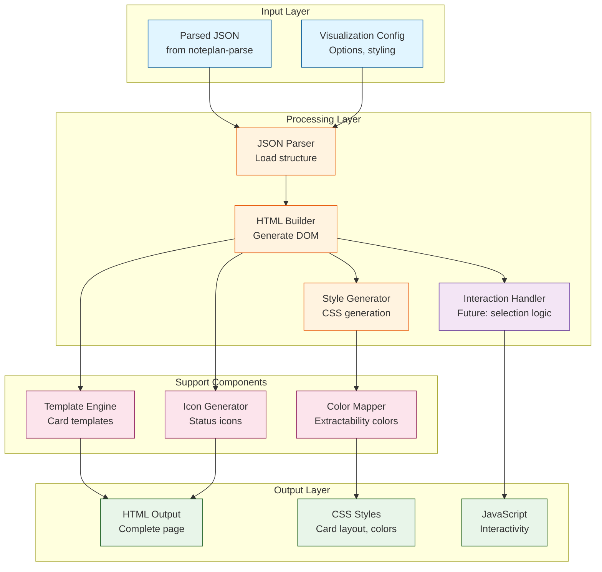
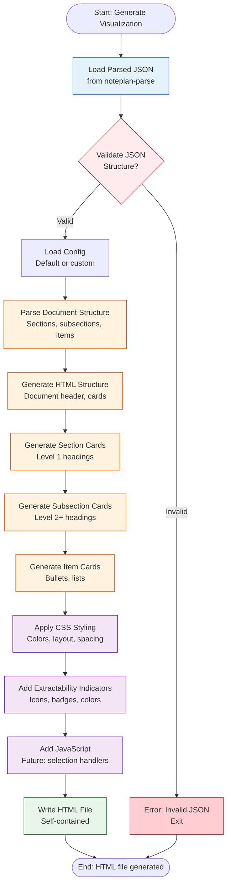
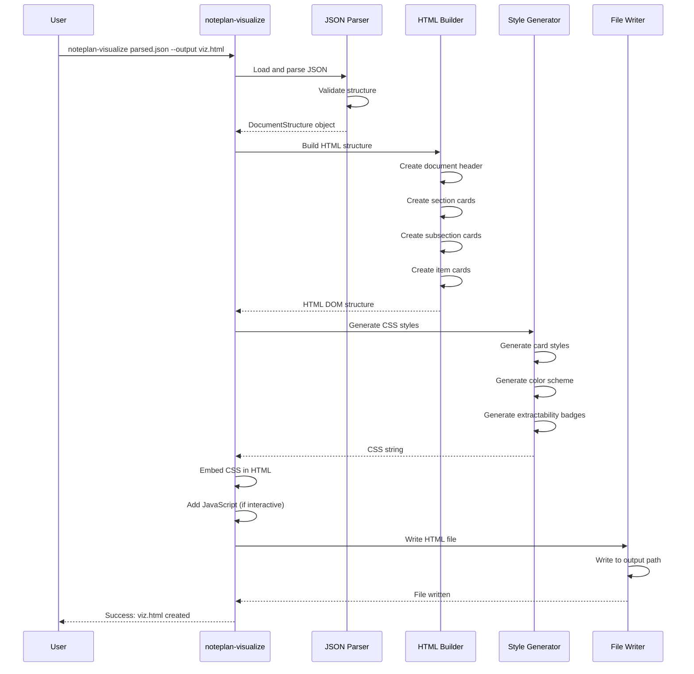

# Document Visualizer Component - Detailed Design

**Author**: Engineering Team  
**Date**: 2025-01-XX  
**Status**: Detailed Design - Component Specification  
**Version**: 1.0  
**Parent Design**: `noteplan-organization.md`

## Overview

The Document Visualizer is a component that takes the parsed document structure (JSON output from `noteplan-parse`) and generates an interactive HTML visualization showing how the document was split into sections, subsections, and items. This visualization will be used for reviewing document structure and, in the future, for interactively selecting sections to move to other documents.

**Critical Requirement**: The visualizer is **READ-ONLY**. It generates HTML output but never modifies source documents.

## Problem Statement

After parsing a document with `noteplan-parse`, we have structured JSON data showing:
- Document sections (level 1 headings)
- Subsections (level 2+ headings)
- Items (bullet points, lists, tasks)
- Extractability flags
- Dependencies

**Challenge**: Need a visual representation that:
1. Shows document structure clearly (sections as cards)
2. Shows hierarchical relationships (subsections within sections)
3. Shows extractability status (what can be moved)
4. Enables future interactive selection for moving sections
5. Provides clear visual feedback for review and approval workflows

## Use Cases

### Use Case 1: Document Structure Review
**User**: Reviews how a daily note was parsed  
**Action**: Views HTML visualization showing all sections and subsections  
**Outcome**: Understands document structure and parsing accuracy

### Use Case 2: Extractability Review
**User**: Reviews which sections can be extracted  
**Action**: Views visualization with extractability indicators  
**Outcome**: Identifies extractable vs non-extractable sections

### Use Case 3: Section Selection (Future)
**User**: Selects sections to move to bucket files  
**Action**: Interacts with visualization to select sections  
**Outcome**: Generates extraction plan based on selections

## Component Architecture

### Architecture Diagram



### Input
- Parsed JSON structure from `noteplan-parse` (DocumentStructure format)
- Visualization configuration (optional):
  - Color scheme
  - Card layout options
  - Show/hide options (items, context, dependencies)
  - Interactive mode (future: selection enabled)

### Output
- HTML file with embedded CSS and JavaScript
- Self-contained visualization (can be opened in browser)
- Interactive card-based layout showing document structure

## Visual Design

### Card Layout Structure

```
┌─────────────────────────────────────────────────────────┐
│ 📄 Document: Calendar/20250113.txt                      │
│ ──────────────────────────────────────────────────────── │
│                                                          │
│ ┌─────────────────────────────────────────────────────┐ │
│ │ # Work [sect-001] ✅ Extractable                    │ │
│ │ ─────────────────────────────────────────────────── │ │
│ │                                                      │ │
│ │ ┌────────────────────────────────────────────────┐ │ │
│ │ │ ## Project X Planning Meeting [subsect-001]    │ │ │
│ │ │ ✅ Extractable                                  │ │ │
│ │ │ ────────────────────────────────────────────── │ │ │
│ │ │ 📝 Context: "Discussed roadmap for Q2:"        │ │ │
│ │ │                                                │ │ │
│ │ │ • Feature A: High priority [item-001]          │ │ │
│ │ │   ✅ Extractable                                │ │ │
│ │ │   ├─ • Design mockups needed [item-001-1]      │ │ │
│ │ │   └─ • Engineering estimate: 2 weeks [item-001-2]│ │ │
│ │ │                                                │ │ │
│ │ │ • Feature B: Deferred [item-002]               │ │ │
│ │ │   ✅ Extractable                                │ │ │
│ │ │   └─ • Waiting on stakeholder feedback [item-002-1]│ │ │
│ │ └────────────────────────────────────────────────┘ │ │
│ │                                                      │ │
│ │ ┌────────────────────────────────────────────────┐ │ │
│ │ │ ## Project Y Review [subsect-002]               │ │ │
│ │ │ ✅ Extractable                                  │ │ │
│ │ │ ...                                             │ │ │
│ │ └────────────────────────────────────────────────┘ │ │
│ └─────────────────────────────────────────────────────┘ │
│                                                          │
│ ┌─────────────────────────────────────────────────────┐ │
│ │ # Personal [sect-002] ✅ Extractable                │ │
│ │ ─────────────────────────────────────────────────── │ │
│ │ ...                                                 │ │
│ └─────────────────────────────────────────────────────┘ │
└─────────────────────────────────────────────────────────┘
```

### Visual Elements

1. **Document Header Card**
   - Document path/filename
   - Metadata (frontmatter if present)
   - Summary statistics (total sections, items, extractable units)

2. **Section Cards** (Level 1 headings)
   - Large horizontal cards
   - Section heading
   - Extractability indicator (✅ Extractable / ⚠️ Has Dependencies)
   - Contains subsection cards

3. **Subsection Cards** (Level 2+ headings)
   - Nested within section cards
   - Smaller horizontal cards
   - Subsection heading
   - Extractability indicator
   - Contains items

4. **Item Cards** (Bullet points, lists)
   - Small cards or list items
   - Item content
   - Extractability indicator
   - Indented sub-items shown nested

5. **Status Indicators**
   - ✅ Green: Extractable (no dependencies)
   - ⚠️ Yellow: Has dependencies (needs review)
   - ❌ Red: Not extractable (critical dependencies)
   - 🔗 Link icon: Has cross-references

## Data Structures

### Visualization Configuration

```typescript
interface VisualizationConfig {
  // Display options
  showItems: boolean;              // Show individual items
  showContext: boolean;            // Show context text
  showDependencies: boolean;       // Show dependency information
  showLineNumbers: boolean;        // Show line numbers
  showHashes: boolean;             // Show content hashes
  
  // Layout options
  cardLayout: "horizontal" | "vertical" | "compact";
  subsectionNesting: "cards" | "indented" | "tabs";
  itemDisplay: "cards" | "list" | "compact";
  
  // Color scheme
  colors: {
    extractable: string;          // Green for extractable
    hasDependencies: string;      // Yellow for dependencies
    notExtractable: string;       // Red for non-extractable
    sectionBackground: string;     // Section card background
    subsectionBackground: string; // Subsection card background
  };
  
  // Interactive mode (future)
  interactive: boolean;           // Enable selection
  selectionMode: "single" | "multiple";
}
```

### HTML Structure

```html
<!DOCTYPE html>
<html>
<head>
  <title>Document Visualization: Calendar/20250113.txt</title>
  <style>
    /* Embedded CSS */
  </style>
</head>
<body>
  <div class="document-visualization">
    <!-- Document Header -->
    <div class="doc-header">
      <h1>📄 Calendar/20250113.txt</h1>
      <div class="doc-metadata">...</div>
    </div>
    
    <!-- Section Cards -->
    <div class="section-card" data-section-id="sect-001" data-extractable="true">
      <div class="section-header">
        <h2># Work</h2>
        <span class="extractability-badge extractable">✅ Extractable</span>
      </div>
      
      <!-- Subsection Cards -->
      <div class="subsection-card" data-subsection-id="subsect-001" data-extractable="true">
        <div class="subsection-header">
          <h3>## Project X Planning Meeting</h3>
          <span class="extractability-badge extractable">✅ Extractable</span>
        </div>
        
        <div class="context">📝 Context: "Discussed roadmap for Q2:"</div>
        
        <!-- Items -->
        <div class="item-list">
          <div class="item-card" data-item-id="item-001" data-extractable="true">
            <span class="item-content">• Feature A: High priority</span>
            <span class="extractability-badge extractable">✅</span>
            <div class="sub-items">
              <div class="sub-item">• Design mockups needed</div>
              <div class="sub-item">• Engineering estimate: 2 weeks</div>
            </div>
          </div>
        </div>
      </div>
    </div>
  </div>
  
  <script>
    // Embedded JavaScript for interactivity
  </script>
</body>
</html>
```

## Activity Diagram

### Visualization Generation Flow



## Sequence Diagram

### Visualization Generation Sequence



## Implementation Details

### Script Location and Naming

- **Script Path**: `/Users/omareid/Workspace/git/workspace/scripts/noteplan-visualize`
- **Script Name**: `noteplan-visualize`
- **Executable**: Should be executable (`chmod +x`) and have shebang (`#!/usr/bin/env python3` or `#!/usr/bin/env node`)
- **Integration**: Used by `organize-noteplan.sh` for review workflows

### Technology Stack Options

**Option A: Python + Jinja2**
- **Language**: Python 3
- **Template Engine**: Jinja2
- **HTML Generation**: Template-based
- **Pros**: Consistent with `noteplan-parse`, easy JSON handling
- **Cons**: Requires Jinja2 dependency

**Option B: Node.js + Handlebars**
- **Language**: JavaScript/Node.js
- **Template Engine**: Handlebars
- **HTML Generation**: Template-based
- **Pros**: Native JSON handling, good for future interactivity
- **Cons**: Requires Node.js

**Option C: Python + String Templates**
- **Language**: Python 3
- **Template Engine**: Built-in string templates
- **HTML Generation**: Programmatic
- **Pros**: No external dependencies
- **Cons**: More verbose

**Recommendation**: **Option A (Python + Jinja2)** for consistency with `noteplan-parse` and ease of JSON handling.

### Command-Line Interface

**Basic Usage**:
```bash
# Generate visualization from parsed JSON
noteplan-visualize analysis/parsed/20250113.json --output visualization/20250113.html

# Generate with custom config
noteplan-visualize parsed.json --output viz.html --config custom-config.json

# Generate with specific options
noteplan-visualize parsed.json --output viz.html --show-items --show-context --interactive

# Generate for multiple files
noteplan-visualize analysis/parsed/*.json --output-dir visualizations/
```

**Command-Line Arguments**:
```bash
noteplan-visualize [OPTIONS] INPUT_FILE...

Options:
  --output, -o FILE          Output HTML file (default: stdout or input.html)
  --output-dir DIR            Output directory for multiple files
  --config FILE               Configuration file (JSON)
  --show-items                Show individual items (default: true)
  --hide-items                Hide individual items
  --show-context              Show context text (default: true)
  --hide-context              Hide context text
  --show-dependencies         Show dependency information (default: true)
  --hide-dependencies         Hide dependencies
  --show-line-numbers         Show line numbers (default: false)
  --card-layout LAYOUT        Layout: horizontal, vertical, compact (default: horizontal)
  --interactive               Enable interactive mode (future: selection)
  --color-scheme SCHEME        Color scheme: default, dark, high-contrast
  --help, -h                  Show help message
```

### HTML Template Structure

**Template File**: `scripts/templates/document-visualization.html.j2`

```jinja2
<!DOCTYPE html>
<html lang="en">
<head>
    <meta charset="UTF-8">
    <meta name="viewport" content="width=device-width, initial-scale=1.0">
    <title>Document Visualization: {{ document.path }}</title>
    <style>
        /* Embedded CSS generated from config */
        {{ css_styles }}
    </style>
</head>
<body>
    <div class="document-visualization">
        <!-- Document Header -->
        <div class="doc-header">
            <h1>📄 {{ document.path }}</h1>
            
            <div class="doc-metadata">
                <h3>Frontmatter</h3>
                <pre>{{ document.frontmatter | tojson(indent=2) }}</pre>
            </div>
            
            <div class="doc-stats">
                <span>Total Sections: {{ document.sections | length }}</span>
                <span>Extractable: {{ extractable_count }}</span>
            </div>
        </div>
        
        <!-- Section Cards -->
        
        <div class="section-card" 
             data-section-id="{{ section.id }}" 
             data-extractable="{{ section.extractable | lower }}">
            <div class="section-header">
                <h2>{{ section.heading_text }}</h2>
                
                <span class="extractability-badge extractable">✅ Extractable</span>
                
                <span class="extractability-badge has-dependencies">
                    ⚠️ Has Dependencies ({{ section.extraction_dependencies | length }})
                </span>
                
            </div>
            
            
            <div class="line-info">Lines {{ section.line_start }}-{{ section.line_end }}</div>
            
            
            
            <div class="section-context">📝 Context: {{ section.context }}</div>
            
            
            <!-- Subsections -->
            
            
            <div class="subsection-card" 
                 data-subsection-id="{{ subsection.id }}" 
                 data-extractable="{{ subsection.extractable | lower }}">
                <div class="subsection-header">
                    <h3>{{ subsection.heading_text }}</h3>
                    
                    <span class="extractability-badge extractable">✅ Extractable</span>
                    
                    <span class="extractability-badge has-dependencies">⚠️ Has Dependencies</span>
                    
                </div>
                
                
                <div class="subsection-context">📝 {{ subsection.context }}</div>
                
                
                <!-- Items -->
                
                <div class="item-list">
                    
                    <div class="item-card" 
                         data-item-id="{{ item.id }}" 
                         data-extractable="{{ item.extractable | lower }}">
                        <span class="item-content">{{ item.content }}</span>
                        
                        <span class="extractability-badge extractable small">✅</span>
                        
                        
                        
                        <div class="sub-items" style="margin-left: {{ item.indent_level * 20 }}px">
                            
                            
                            <div class="sub-item">{{ child_item.content }}</div>
                            
                        </div>
                        
                    </div>
                    
                </div>
                
            </div>
            
        </div>
        
    </div>
    
    
    <script>
        // Future: Interactive selection logic
        // For now, just visual feedback
    </script>
    
</body>
</html>
```

### CSS Styling

**Card-Based Layout**:
```css
.document-visualization {
    font-family: -apple-system, BlinkMacSystemFont, 'Segoe UI', sans-serif;
    max-width: 1200px;
    margin: 0 auto;
    padding: 20px;
}

.section-card {
    background: #f5f5f5;
    border: 2px solid #ddd;
    border-radius: 8px;
    margin: 20px 0;
    padding: 20px;
    box-shadow: 0 2px 4px rgba(0,0,0,0.1);
}

.section-card[data-extractable="true"] {
    border-color: #4caf50;
}

.section-card[data-extractable="false"] {
    border-color: #ff9800;
}

.subsection-card {
    background: white;
    border: 1px solid #ccc;
    border-radius: 6px;
    margin: 15px 0;
    padding: 15px;
    margin-left: 20px;
}

.item-card {
    padding: 8px;
    margin: 5px 0;
    border-left: 3px solid transparent;
}

.item-card[data-extractable="true"] {
    border-left-color: #4caf50;
}

.extractability-badge {
    display: inline-block;
    padding: 4px 8px;
    border-radius: 4px;
    font-size: 0.9em;
    font-weight: bold;
}

.extractability-badge.extractable {
    background: #c8e6c9;
    color: #2e7d32;
}

.extractability-badge.has-dependencies {
    background: #fff3c4;
    color: #f57c00;
}
```

## Future: Interactive Selection

### Planned Features

1. **Click to Select**: Click on section/subsection cards to select for extraction
2. **Multi-Select**: Select multiple sections for batch extraction
3. **Dependency Highlighting**: Highlight dependencies when selecting a section
4. **Preview Extraction**: Show preview of what will be extracted
5. **Export Selection**: Export selected sections as extraction plan JSON

### JavaScript Structure (Future)

```javascript
// Future interactive functionality
class DocumentVisualizer {
    constructor() {
        this.selectedSections = new Set();
        this.initEventListeners();
    }
    
    initEventListeners() {
        document.querySelectorAll('.section-card, .subsection-card').forEach(card => {
            card.addEventListener('click', (e) => {
                this.toggleSelection(card);
            });
        });
    }
    
    toggleSelection(card) {
        const sectionId = card.dataset.sectionId || card.dataset.subsectionId;
        if (this.selectedSections.has(sectionId)) {
            this.selectedSections.delete(sectionId);
            card.classList.remove('selected');
        } else {
            this.selectedSections.add(sectionId);
            card.classList.add('selected');
            this.highlightDependencies(card);
        }
    }
    
    highlightDependencies(card) {
        // Highlight sections that must be extracted together
    }
    
    exportSelection() {
        // Export selected sections as extraction plan
    }
}
```

## Testing Strategy

### Test Location

- **Test Directory**: `/Users/omareid/Workspace/git/workspace/tests/noteplan-visualize/`
- **Test Script**: `tests/noteplan-visualize/test-noteplan-visualize.sh`
- **Test Fixtures**: `tests/noteplan-visualize/fixtures/` (sample parsed JSON)
- **Expected Output**: `tests/noteplan-visualize/expected/` (sample HTML files)

### Test Cases

1. **Basic Visualization**
   - Generate HTML from simple parsed JSON
   - Verify all sections are rendered
   - Verify extractability badges are correct

2. **Layout Tests**
   - Test horizontal card layout
   - Test vertical card layout
   - Test compact layout

3. **Content Display Tests**
   - Verify items are shown/hidden based on config
   - Verify context is shown/hidden based on config
   - Verify line numbers are shown/hidden based on config

4. **Extractability Display Tests**
   - Verify extractable sections show green badge
   - Verify sections with dependencies show yellow badge
   - Verify dependency count is displayed

5. **Read-Only Verification**
   - Verify script never modifies source JSON files
   - Verify script only writes to output HTML file

6. **HTML Validation**
   - Verify generated HTML is valid
   - Verify CSS is embedded correctly
   - Verify JavaScript is embedded correctly (if interactive)

## Implementation Checklist

### Script Implementation
- [ ] Create script at `/Users/omareid/Workspace/git/workspace/scripts/noteplan-visualize`
- [ ] **CRITICAL**: Ensure script is read-only (never modifies source JSON files)
- [ ] Implement JSON parsing (load DocumentStructure)
- [ ] Implement HTML template engine (Jinja2)
- [ ] Implement CSS generation
- [ ] Implement card layout generation
- [ ] Implement extractability badge generation
- [ ] Add command-line argument parsing
- [ ] Add configuration file support
- [ ] Add error handling and validation

### Template Implementation
- [ ] Create HTML template: `scripts/templates/document-visualization.html.j2`
- [ ] Implement section card template
- [ ] Implement subsection card template
- [ ] Implement item card template
- [ ] Implement extractability badge template
- [ ] Implement document header template

### CSS Implementation
- [ ] Create card-based layout styles
- [ ] Create extractability badge styles
- [ ] Create color scheme (default, dark, high-contrast)
- [ ] Create responsive layout (mobile-friendly)
- [ ] Create print-friendly styles

### Testing
- [ ] Create test directory: `tests/noteplan-visualize/`
- [ ] Create test script: `tests/noteplan-visualize/test-noteplan-visualize.sh`
- [ ] Create sample parsed JSON fixtures
- [ ] Create expected HTML outputs
- [ ] Implement read-only verification tests
- [ ] Implement HTML validation tests
- [ ] Add git hook for pre-commit testing

### Integration
- [ ] Integrate with `organize-noteplan.sh`
- [ ] Add visualization step to review workflow
- [ ] Document usage in main design
- [ ] Add Makefile target: `make visualize-noteplan`

## Related Components

This component:
- **Consumes**: Output from `noteplan-parse` script (parsed JSON)
- **Used by**: `organize-noteplan.sh` for review workflows
- **Future**: Will integrate with extraction planning for interactive selection

## Open Questions

1. Should visualization be interactive from the start, or start as read-only?
2. What level of detail should be shown by default? (items, context, dependencies)
3. Should we support exporting visualization as PDF?
4. Should we support embedding visualizations in markdown reports?
5. How should we handle very large documents (100+ sections)?
