# NotePlan Organization System - Design Document

**Author**: Engineering Team  
**Date**: 2025-01-XX  
**Status**: Design Proposal - Pending Approval  
**Version**: 1.0

## Executive Summary

This design document proposes a systematic approach to organizing NotePlan notes while maintaining absolute data integrity. The solution operates entirely within a git-controlled environment, ensuring every change is tracked, reviewable, and reversible. **No modifications will be made to the actual NotePlan data until explicitly approved.**

**Key Design Decisions**:
- Git-based workflow for all operations
- Local LLM integration via `ccr code` CLI
- Multi-phase analysis with approval gates
- Complete audit trail via git commits
- Zero direct modification of source data

## Requirements

### Critical Requirements (Must Have)

1. **Data Integrity**
   - ✅ **Question**: "How do you guarantee no data loss?"
   - ✅ **Answer**: All operations in git repository with full version control. No direct modification of NotePlan iCloud directory. All changes reversible via git history.

2. **Approval Workflow**
   - ✅ **Question**: "How do I review and approve changes before they happen?"
   - ✅ **Answer**: All proposed changes committed to git as reviewable plans. Interactive approval interface. No execution without explicit approval.

3. **Git Integration**
   - ✅ **Question**: "Does this work with my existing `make sync` workflow at `/Users/omareid/workplace/git/planner`?"
   - ✅ **Answer**: Yes. All work happens in that git repository. Syncs use your existing workflow. All analysis and plans are git commits.

4. **Link Preservation**
   - ✅ **Question**: "Will NotePlan links `[[note name]]` break when files move?"
   - ✅ **Answer**: No. Link analysis before moves. Link validation after moves. NotePlan link format preserved (links work by name, not path).

5. **Context & Enrichment**
   - ✅ **Question**: "How do you understand note relationships and context?"
   - ✅ **Answer**: Link discovery and enrichment. Git history analysis. Content analysis. Relationship mapping. All committed to git for review.

6. **Audit Trail**
   - ✅ **Question**: "Can I see what decisions were made and why?"
   - ✅ **Answer**: Yes. Every analysis, decision, and plan is a git commit with clear messages. Full diffs show all changes. Rationale documented in plan files.

### Important Requirements (Should Have)

7. **Performance**
   - ✅ **Question**: "How long will this take?"
   - ✅ **Answer**: Analysis phases: ~12-17 hours. Your review time: variable. Execution: 1-2 hours after approval.

8. **Flexibility**
   - ✅ **Question**: "Can I modify the plan before execution?"
   - ✅ **Answer**: Yes. Plan is a git commit that can be amended. Interactive review allows approve/reject/modify per move.

9. **Rollback Capability**
   - ✅ **Question**: "What if I don't like the results?"
   - ✅ **Answer**: Git tags created before execution. Full git history allows reverting. Can rollback to any previous state.

### Nice to Have (Could Have)

10. **Automation**
    - ⚠️ **Question**: "Can this be automated for future organization?"
    - ⚠️ **Answer**: Initial implementation is manual with approval. Future enhancement could add periodic analysis and suggestions.

11. **Visualization**
    - ⚠️ **Question**: "Can I see folder structure changes visually?"
    - ⚠️ **Answer**: Yes. Markdown reports with folder trees. Future enhancement could add interactive tree diagrams.

12. **Note Ingestion**
    - ✅ **Question**: "How will the system ingest/index all my existing notes?"
    - ✅ **Answer**: Complete file discovery and indexing. Content hashing (SHA-256) for change detection. Full manifest with metadata. All stored in git for review.

13. **Decision Logic**
    - ✅ **Question**: "How does the system know where to move notes?"
    - ✅ **Answer**: Multi-factor scoring: content analysis (40%), git history patterns (30%), link relationships (20%), path context (10%). AI-assisted categorization with confidence levels. All factors documented in plan.

14. **Metadata Requirements**
    - ✅ **Question**: "Do my notes need additional metadata/frontmatter?"
    - ✅ **Answer**: No. System works with notes as-is (plain text). Optional frontmatter is preserved if present. Metadata is inferred from content, paths, links, and git history.

15. **Execution & Runtime**
    - ✅ **Question**: "How long will this take and how do I run it?"
    - ✅ **Answer**: ~6-13 hours automated (mostly AI analysis). Your review: 1-4 hours. Simple CLI: `organize-noteplan.sh --phase <phase>`. Progress tracking and resumable.

16. **Cloud Conflict Handling**
    - ✅ **Question**: "How do we handle conflicts when notes change between analysis and approval?"
    - ✅ **Answer**: Hash-based change detection. Before execution, re-sync and validate content hashes. Skip conflicted notes and report. You choose: re-analyze, manually resolve, skip, or force. No data loss.

## Core Principles & Guarantees

### Data Safety (Non-Negotiable)
1. **Zero Data Loss**: Every operation will be performed in a git repository with full version control. No changes to your actual NotePlan iCloud directory until approval.
2. **No Direct Modification**: All work happens in the git repository at `/Users/omareid/workplace/git/planner`. Your live NotePlan data remains untouched.
3. **Complete Audit Trail**: Every decision, analysis, and proposed change will be documented in git commits with clear, reviewable diffs.
4. **Reversible Operations**: All changes can be undone via git history. Full backups will be created before any approved operations.

### Git-Based Workflow
All organization work will be performed in the git repository environment:
- **Sync Point**: `/Users/omareid/workplace/git/planner`
- **Sync Command**: `make sync` (to sync changes from NotePlan to the local git repo)
- **Version Control**: All analysis and organization proposals will be committed to git
- **Review Process**: You review git diffs and commit history before approving any changes

## Proposed Workflow

### Phase 1: Initial Sync & Baseline Commit
**Objective**: Establish a clean baseline in git without modifying your data.

1. **Sync Current State**
   - Run `make sync` at `/Users/omareid/workplace/git/planner` to sync all current NotePlan notes to the git repository
   - This creates a snapshot of your current note organization

2. **Initial Commit**
   - Commit the current state: `git commit -m "Baseline: Current note organization state"`
   - This establishes a reference point for all future changes

3. **Document Current Structure**
   - Generate a report of current file locations, folder structure, and note counts
   - Commit this analysis: `git commit -m "Analysis: Current note structure documentation"`

### Phase 2: Analysis & Link Enrichment
**Objective**: Understand your notes deeply and enrich link context before making organization decisions.

1. **Link Discovery & Analysis**
   - Scan all notes for links (NotePlan links `[[note name]]`, vscode links, ia-writer links, URLs)
   - Use existing tools (`find-links`, `validate-links`) to catalog all link relationships
   - Identify broken links, orphaned notes, and link clusters

2. **Link Enrichment**
   - For each URL link, fetch page titles and context (similar to `iphone-link-enricher.py`)
   - For each NotePlan internal link, analyze the target note's content and purpose
   - Build a link relationship map showing how notes connect to each other

3. **Content Analysis**
   - Analyze note content to understand:
     - Topics and themes
     - Project associations
     - Date relevance (Calendar vs Notes)
     - Relationships to other notes
   - Use AI assistance (via `ccr code`) to categorize notes, but only for analysis, not execution

4. **Commit Analysis Results**
   - Commit all analysis data: `git commit -m "Analysis: Link relationships and content categorization"`
   - This includes JSON files with link maps, categorization data, and enrichment results

### Phase 3: Git History Study
**Objective**: Understand how your notes have evolved to make informed organization decisions.

1. **Review Git History**
   - Study commit history to understand:
     - How notes have been moved in the past
     - Patterns in note creation and organization
     - Your organizational preferences over time
   - Analyze diffs to see what changes you've made manually

2. **Pattern Recognition**
   - Identify organizational patterns from your git history:
     - Preferred folder structures
     - Naming conventions you've used
     - How you've handled similar notes in the past

3. **Commit Analysis**
   - Commit findings: `git commit -m "Analysis: Organizational patterns from git history"`

### Phase 4: Organization Plan Creation
**Objective**: Create a comprehensive, reviewable plan for note organization.

1. **Proposed Moves**
   - Based on analysis (content, links, history patterns), propose:
     - Which notes should move
     - Target locations for each note
     - Rationale for each move
     - Confidence level (high/medium/low)

2. **Link Preservation Strategy**
   - For each proposed move, ensure:
     - NotePlan links `[[note name]]` will continue to work
     - Related notes stay logically grouped
     - Link clusters are preserved

3. **Plan Documentation**
   - Create a structured plan document (JSON + human-readable markdown) showing:
     ```json
     {
       "proposed_moves": [
         {
           "source": "Calendar/20250113.txt",
           "target": "Notes/Projects/Work/20250113.txt",
           "reason": "Contains project planning content, not calendar entry",
           "confidence": "high",
           "affected_links": ["[[Project Planning]]", "[[Work Tasks]]"],
           "related_notes": ["Notes/Projects/Work/20250112.txt"]
         }
       ],
       "summary": {
         "total_moves": 42,
         "high_confidence": 35,
         "medium_confidence": 5,
         "low_confidence": 2,
         "notes_requiring_review": 7
       }
     }
     ```

4. **Commit Plan**
   - Commit the organization plan: `git commit -m "Plan: Proposed note organization (pending approval)"`
   - This plan is reviewable via git diff and can be modified before execution

### Phase 5: Plan Presentation & Approval
**Objective**: Present the plan in an easily comprehensible format for your review and approval.

1. **Human-Readable Report**
   - Generate a markdown report showing:
     - Summary statistics (total moves, confidence breakdown)
     - Grouped moves by category (Calendar→Notes, folder reorganization, etc.)
     - Visual representation of folder structure changes
     - Link impact analysis (which links will be affected)

2. **Interactive Review Interface**
   - Provide a script that allows you to:
     - Review all proposed moves
     - Approve/reject individual moves
     - Approve/reject by category
     - Request modifications to the plan
     - See preview of folder structure after changes

3. **Approval Workflow**
   - You review the plan document and git commit
   - You can modify the plan (I'll update the commit)
   - Once approved, the plan is marked as `APPROVED` in git
   - Only then will execution proceed

### Phase 6: Execution (Only After Approval)
**Objective**: Execute approved moves in the git repository, then sync back to NotePlan.

1. **Pre-Execution Safety**
   - Create full backup: `git tag backup-before-organization-$(date +%Y%m%d)`
   - Verify git repository is clean and synced

2. **Execute Moves in Git**
   - Perform all approved file moves in the git repository
   - Update any link references if necessary
   - Commit changes: `git commit -m "Execute: Approved note organization"`

3. **Verification**
   - Verify all moves completed successfully
   - Check that links still work correctly
   - Generate post-organization report

4. **Sync to NotePlan** (Your Decision)
   - **Option A**: You manually review the git changes and sync when ready
   - **Option B**: I provide a script to sync changes back (with your explicit approval)
   - **Option C**: You handle the sync yourself using your existing `make sync` workflow

5. **Final Commit**
   - Commit execution results: `git commit -m "Complete: Note organization executed and verified"`

## Deliverables

### 1. Analysis Artifacts (in git)
- Link relationship map (JSON)
- Content categorization data (JSON)
- Git history analysis report (markdown)
- Organizational pattern documentation (markdown)

### 2. Organization Plan (in git)
- Structured plan file (JSON) with all proposed moves
- Human-readable plan document (markdown)
- Interactive review script for approval workflow
- Summary statistics and visualizations

### 3. Execution Results (in git)
- All file moves as git commits
- Post-organization verification report
- Link validation results
- Final folder structure documentation

### 4. Documentation
- Process documentation (this proposal)
- Usage guide for review/approval workflow
- Rollback procedures (if needed)

## Technical Design

### AI/LLM Integration Approach

This section evaluates different approaches for AI-assisted note analysis and categorization.

| Concern | Claude Agent | Claude Skill | Claude Code CLI (`ccr code`) | **Selected** |
|---------|--------------|--------------|------------------------------|--------------|
| **Local LLM Support** | ❌ Cloud-only | ❌ Cloud-only | ✅ Local LLM via LM Studio | ✅ **ccr code** |
| **Cost** | 💰 API costs per call | 💰 API costs per call | ✅ Free (local) | ✅ **ccr code** |
| **Privacy** | ⚠️ Data sent to cloud | ⚠️ Data sent to cloud | ✅ All local processing | ✅ **ccr code** |
| **Speed** | ✅ Fast (cloud) | ✅ Fast (cloud) | ⚠️ Slower (local LLM) | ⚠️ Acceptable |
| **Context Window** | ✅ Large (200k+) | ✅ Large (200k+) | ⚠️ Model-dependent | ⚠️ Acceptable |
| **Control** | ⚠️ Agent decides actions | ⚠️ Skill decides actions | ✅ Script controls flow | ✅ **ccr code** |
| **Approval Integration** | ❌ Hard to gate | ❌ Hard to gate | ✅ Easy to gate with approval | ✅ **ccr code** |
| **Batch Processing** | ⚠️ Complex | ⚠️ Complex | ✅ Simple script loops | ✅ **ccr code** |
| **Error Handling** | ⚠️ Agent may retry | ⚠️ Skill may retry | ✅ Script handles errors | ✅ **ccr code** |
| **Git Integration** | ⚠️ Complex | ⚠️ Complex | ✅ Simple (script commits) | ✅ **ccr code** |
| **Existing Infrastructure** | ❌ Not in codebase | ❌ Not in codebase | ✅ Already configured (`ccr-config`) | ✅ **ccr code** |

**Decision**: Use **Claude Code CLI (`ccr code`)** for the following reasons:
- ✅ Works with your existing local LLM setup (LM Studio via `ccr-config`)
- ✅ No API costs (all processing local)
- ✅ Full privacy (notes never leave your machine)
- ✅ Script-based control allows precise approval gating
- ✅ Easy integration with git workflow (script commits results)
- ✅ Already configured in your environment

**Usage Pattern**:
- `ccr code` called from bash script for each note analysis
- Results parsed as JSON and committed to git
- All AI calls are for **analysis only**, not execution
- Approval gates prevent any AI-driven execution

### Activity Flow Diagram

```mermaid
flowchart TD
    Start([Start: NotePlan Organization]) --> Sync[Phase 1: Sync to Git<br/>make sync at /Users/omareid/workplace/git/planner]
    Sync --> Baseline[Create Baseline Commit<br/>git commit: Baseline state]
    Baseline --> Doc[Document Current Structure<br/>Generate structure report]
    Doc --> Commit1[Commit Analysis: Current structure]
    
    Commit1 --> LinkDiscovery[Phase 2: Link Discovery<br/>find-links, validate-links]
    LinkDiscovery --> LinkEnrich[Link Enrichment<br/>Fetch URL titles, analyze internal links]
    LinkEnrich --> ContentAnalysis[Content Analysis<br/>ccr code: Categorize notes]
    ContentAnalysis --> Commit2[Commit Analysis: Links & Content]
    
    Commit2 --> GitHistory[Phase 3: Git History Study<br/>Analyze commit history & patterns]
    GitHistory --> Patterns[Pattern Recognition<br/>Identify organizational preferences]
    Patterns --> Commit3[Commit Analysis: Git patterns]
    
    Commit3 --> PlanCreate[Phase 4: Create Organization Plan<br/>Propose moves based on analysis]
    PlanCreate --> PlanDoc[Document Plan<br/>JSON + Markdown report]
    PlanDoc --> Commit4[Commit Plan: Proposed organization]
    
    Commit4 --> Approval1{Manual Approval<br/>Review Plan}
    Approval1 -->|Reject/Modify| PlanCreate
    Approval1 -->|Approve| ReSync[Re-sync from NotePlan<br/>make sync]
    
    ReSync --> ValidateHash[Validate Content Hashes<br/>Compare analysis vs current]
    ValidateHash -->|Conflicts Found| ConflictReport[Generate Conflict Report<br/>Skip conflicted notes]
    ConflictReport --> Approval3{Manual Decision<br/>Resolve Conflicts?}
    Approval3 -->|Re-analyze| ContentAnalysis
    Approval3 -->|Skip| TagBackup
    Approval3 -->|Force| TagBackup
    
    ValidateHash -->|No Conflicts| TagBackup[Phase 6: Pre-Execution Safety<br/>git tag backup-before-org]
    
    TagBackup --> Execute[Execute Moves in Git<br/>Move files, update links]
    Execute --> Verify[Verify Moves<br/>Check links, validate structure]
    Verify --> Commit5[Commit: Executed organization]
    
    Commit5 --> Approval2{Manual Approval<br/>Review Results}
    Approval2 -->|Reject| Rollback[Rollback via Git<br/>git reset --hard backup-tag]
    Rollback --> PlanCreate
    Approval2 -->|Approve| SyncBack{Manual Decision<br/>Sync to NotePlan?}
    
    SyncBack -->|Option A: Manual| ManualSync[You sync manually<br/>make sync workflow]
    SyncBack -->|Option B: Script| ScriptSync[Script syncs with approval]
    SyncBack -->|Option C: Later| Wait[Wait for your sync]
    
    ManualSync --> Final[Final Commit: Complete]
    ScriptSync --> Final
    Wait --> Final
    Final --> End([End: Organization Complete])
    
    style Approval1 fill:#ffd700,stroke:#ff8c00,stroke-width:3px
    style Approval2 fill:#ffd700,stroke:#ff8c00,stroke-width:3px
    style Approval3 fill:#ffd700,stroke:#ff8c00,stroke-width:3px
    style SyncBack fill:#ffd700,stroke:#ff8c00,stroke-width:3px
    style TagBackup fill:#90ee90,stroke:#228b22,stroke-width:2px
    style ValidateHash fill:#87ceeb,stroke:#4682b4,stroke-width:2px
    style ConflictReport fill:#ffa500,stroke:#ff8c00,stroke-width:2px
    style Rollback fill:#ff6b6b,stroke:#c92a2a,stroke-width:2px
```



**Key Points from Flow**:
- 🔶 **Yellow nodes** = Manual approval gates (you must approve)
- 🟢 **Green node** = Safety checkpoint (backup created)
- 🔵 **Blue node** = Validation step (hash checking)
- 🟠 **Orange node** = Conflict detection and reporting
- 🔴 **Red node** = Rollback option (if needed)
- All analysis and planning happens in git before any execution
- Multiple approval points ensure you control the process
- Hash validation prevents overwriting changed notes

## Note Ingestion & Indexing

### Initial Ingestion Process

**Objective**: Create a complete, searchable index of all existing notes without modifying them.

1. **Discovery Phase**
   - Scan `/Users/omareid/workplace/git/planner` after initial `make sync`
   - Recursively find all `.txt` files in `Calendar/` and `Notes/` directories
   - Generate file manifest with:
     - Full path (relative to repo root)
     - File size
     - Last modified timestamp (from filesystem)
     - Git commit hash (if tracked)
     - Content hash (SHA-256) for change detection

2. **Content Indexing**
   - For each note file:
     - Read full content
     - Extract first line (potential title/header)
     - Count lines, words, characters
     - Identify note type (Calendar date format `YYYYMMDD.txt` vs regular note)
     - Parse links (NotePlan `[[links]]`, vscode links, URLs)
     - Extract dates mentioned in content
     - Detect frontmatter/metadata if present (YAML blocks)

3. **Index Storage**
   - Create `analysis/note-index.json` with structure:
     ```json
     {
       "ingestion_timestamp": "2025-01-XXT...",
       "total_notes": 1234,
       "notes": [
         {
           "path": "Calendar/20250113.txt",
           "content_hash": "sha256:abc123...",
           "file_hash": "sha256:def456...",
           "size_bytes": 2048,
           "modified_time": "2025-01-13T10:30:00Z",
           "git_commit": "abc123def...",
           "note_type": "calendar",
           "first_line": "# Daily Notes",
           "line_count": 45,
           "word_count": 234,
           "links": {
             "noteplan": ["[[Project Planning]]", "[[Work Tasks]]"],
             "urls": ["https://example.com"],
             "vscode": []
           },
           "dates_mentioned": ["2025-01-13"],
           "has_frontmatter": false,
           "metadata": null
         }
       ]
     }
     ```
   - Commit index: `git commit -m "Index: Complete note inventory and content hashes"`

4. **Hash-Based Change Detection**
   - **Content Hash**: SHA-256 of file contents (detects content changes)
   - **File Hash**: SHA-256 of path + content (detects moves + content changes)
   - Store both hashes for each note at ingestion time
   - Use hashes to detect conflicts during approval lag (see Conflict Handling section)

### Metadata & Frontmatter Analysis

**Current State Assessment**:
- Most NotePlan notes are plain text without frontmatter
- Some notes may have YAML frontmatter blocks (if manually added)
- Calendar notes use date-based filenames (`YYYYMMDD.txt`) as primary metadata

**Metadata Strategy**:
1. **No Required Metadata**: System works with notes as-is (plain text)
2. **Optional Frontmatter Enhancement**: If notes have frontmatter, extract and index:
   ```yaml
   ---
   tags: [work, project-planning]
   category: projects
   created: 2025-01-13
   ---
   ```
3. **Inferred Metadata**: Extract metadata from:
   - File path (folder structure)
   - Filename patterns (dates, project names)
   - Content analysis (topics, themes)
   - Link relationships
   - Git history patterns

**Decision**: **No frontmatter required**. System analyzes content and context to make organization decisions. Frontmatter, if present, will be preserved and can inform decisions, but is not required.

## Decision Logic: Where to Move Notes

### Multi-Factor Decision Framework

The system uses a weighted scoring approach combining multiple signals:

1. **Content Analysis (40% weight)**
   - AI categorization via `ccr code`:
     - Topics/themes extracted from content
     - Project associations identified
     - Date relevance (calendar entry vs project note)
     - Content type (meeting notes, todo list, reference, etc.)
   - Example prompt to `ccr code`:
     ```
     Analyze this note and determine:
     1. Primary topic/theme
     2. Project association (if any)
     3. Should this be in Calendar/ or Notes/?
     4. Suggested folder path (e.g., Notes/Projects/Work/ProjectName/)
     5. Confidence level (high/medium/low)
     
     Note content: [first 2000 chars]
     Current path: Calendar/20250113.txt
     ```

2. **Git History Patterns (30% weight)**
   - Analyze past moves: "Where have similar notes been moved before?"
   - Folder structure preferences: "What folder patterns do you use?"
   - Naming conventions: "How do you name project folders?"
   - Extract patterns from git log:
     ```bash
     git log --all --name-status --diff-filter=R | \
       grep -E "^R[0-9]+" | \
       # Analyze rename patterns
     ```

3. **Link Relationships (20% weight)**
   - Cluster analysis: Notes that link to each other should be near each other
   - Link density: Notes with many internal links stay in main areas
   - Orphan detection: Isolated notes can be organized independently
   - Example: If `NoteA` links to `NoteB` and `NoteC`, consider keeping them in same folder

4. **File Path Context (10% weight)**
   - Current location provides signal (even if wrong)
   - Calendar vs Notes distinction
   - Existing folder structure (if organized, maintain patterns)

### Decision Output Format

For each note, the system produces:
```json
{
  "note_path": "Calendar/20250113.txt",
  "content_hash": "sha256:abc123...",
  "analysis": {
    "current_location_score": 0.2,
    "proposed_location": "Notes/Projects/Work/ProjectName/20250113.txt",
    "proposed_location_score": 0.85,
    "confidence": "high",
    "factors": {
      "content_analysis": {
        "score": 0.9,
        "reasoning": "Contains project planning content, not calendar entry"
      },
      "git_history": {
        "score": 0.8,
        "reasoning": "Similar notes moved to Notes/Projects/Work/ in past"
      },
      "link_relationships": {
        "score": 0.7,
        "reasoning": "Links to 3 other notes in Notes/Projects/Work/"
      },
      "path_context": {
        "score": 0.2,
        "reasoning": "Currently in Calendar/ but content suggests Notes/"
      }
    },
    "alternatives": [
      {
        "path": "Notes/Projects/Work/20250113.txt",
        "score": 0.75,
        "reasoning": "Alternative: Keep in Work root, not subfolder"
      }
    ]
  }
}
```

### Confidence Levels

- **High (0.8-1.0)**: Strong signals from multiple factors, clear organization pattern
- **Medium (0.5-0.8)**: Good signals but some ambiguity, may need review
- **Low (<0.5)**: Weak or conflicting signals, definitely needs manual review

## Execution Details

### How to Run

**Prerequisites**:
```bash
# 1. Ensure git repo is set up
cd /Users/omareid/workplace/git/planner

# 2. Verify make sync works
make sync

# 3. Ensure ccr code is configured
ccr-config show  # Should show active configuration
```

**Execution Commands**:

```bash
# Phase 1: Initial sync and baseline
cd /Users/omareid/workplace/git/planner
make sync
organize-noteplan.sh --phase baseline

# Phase 2: Analysis (can run in background, takes hours)
organize-noteplan.sh --phase analyze

# Phase 3: Git history study
organize-noteplan.sh --phase history

# Phase 4: Create plan
organize-noteplan.sh --phase plan

# Phase 5: Review and approve (interactive)
organize-noteplan.sh --phase review

# Phase 6: Execute (only after approval)
organize-noteplan.sh --phase execute --approved-plan <plan-id>
```

**Or run all phases sequentially**:
```bash
organize-noteplan.sh --all-phases
# Stops at each approval gate for your review
```

### Runtime Estimates

| Phase | Operation | Estimated Time | Notes |
|-------|-----------|----------------|-------|
| **Phase 1** | Sync & Baseline | 5-15 minutes | Depends on note count and sync speed |
| **Phase 2** | Link Discovery | 10-30 minutes | Fast: grep-based scanning |
| **Phase 2** | Link Enrichment | 1-3 hours | Slow: HTTP requests for URL titles |
| **Phase 2** | Content Analysis | 3-6 hours | Very slow: Local LLM calls (1-2 min per note) |
| **Phase 3** | Git History | 30-60 minutes | Fast: git log parsing |
| **Phase 4** | Plan Creation | 1-2 hours | Fast: Algorithm-based scoring |
| **Phase 5** | Review | **Your time** | Variable: Depends on plan size |
| **Phase 6** | Execution | 5-15 minutes | Fast: File moves in git |

**Total Automated Time**: ~6-13 hours (mostly Phase 2 content analysis)  
**Your Review Time**: Variable (estimate 1-4 hours depending on note volume)

**Optimization Strategies**:
- **Parallel Processing**: Content analysis can process multiple notes in parallel (limited by LLM)
- **Caching**: Cache LLM responses for identical/similar notes
- **Incremental**: Can run phases incrementally, pause between phases
- **Resume**: Script can resume from last completed phase

### Progress Tracking

The script will:
- Create `analysis/progress.json` tracking current phase
- Log all operations to `analysis/execution.log`
- Show progress bars for long-running operations
- Provide ETA estimates based on current processing rate

## Cloud Conflict Handling

### Problem Statement

**Scenario**: 
1. Note analyzed at time T1 (content hash: `abc123`)
2. You review and approve move at time T2 (hours/days later)
3. Between T1 and T2, note was edited in NotePlan (new content hash: `def456`)
4. If we execute the move, we might overwrite your recent edits

### Solution: Hash-Based Change Detection

**Pre-Execution Validation**:

Before executing any approved move, the system will:

1. **Re-sync from NotePlan**
   ```bash
   # Before execution, sync latest state
   cd /Users/omareid/workplace/git/planner
   make sync
   ```

2. **Re-compute Hashes**
   - For each note in the approved plan, compute current content hash
   - Compare with hash from analysis phase (stored in plan)

3. **Conflict Detection**
   ```json
   {
     "note": "Calendar/20250113.txt",
     "analysis_hash": "sha256:abc123...",
     "current_hash": "sha256:def456...",
     "status": "CONFLICT",
     "action": "SKIP_AND_REPORT"
   }
   ```

4. **Conflict Resolution Strategy**

   | Scenario | Analysis Hash | Current Hash | Action |
   |----------|---------------|--------------|--------|
   | **No Change** | `abc123` | `abc123` | ✅ Proceed with move |
   | **Content Changed** | `abc123` | `def456` | ⚠️ Skip move, report conflict |
   | **File Moved** | `abc123` (old path) | `abc123` (new path) | ⚠️ Skip move, report (already moved) |
   | **File Deleted** | `abc123` | (not found) | ⚠️ Skip move, report (deleted) |

5. **Conflict Report**
   - Generate `conflicts-$(date +%Y%m%d).json` listing all conflicts
   - Create human-readable report: `conflicts-$(date +%Y%m%d).md`
   - Commit conflict report: `git commit -m "Conflicts: Notes changed since analysis"`
   - **Execution stops** until you review conflicts

6. **Your Options for Conflicts**:
   - **Option A**: Re-analyze conflicted notes (run Phase 2 again for those notes)
   - **Option B**: Manually resolve (edit plan to reflect current state)
   - **Option C**: Skip conflicted notes (leave them in place)
   - **Option D**: Force move anyway (if you're confident changes don't matter)

### Implementation Details

**Hash Storage**:
- Analysis phase stores content hash for each note in `analysis/note-index.json`
- Plan phase includes hash in each proposed move
- Execution phase validates hashes before each move

**Sync Strategy**:
```bash
# Always sync before execution
make sync

# Verify git is clean (no uncommitted changes)
git status --porcelain

# If dirty, abort and report
if [ -n "$(git status --porcelain)" ]; then
  echo "ERROR: Git repo has uncommitted changes. Please commit or stash."
  exit 1
fi
```

**Atomic Operations**:
- Each file move is atomic (git mv)
- If any move fails validation, entire execution stops
- Partial execution is rolled back via git

### Conflict Prevention

**Best Practices**:
1. **Minimize Approval Lag**: Review and approve plans promptly after analysis
2. **Lock Period**: Optionally, avoid editing notes during analysis/approval period
3. **Incremental Execution**: Execute in small batches to reduce time window
4. **Re-validation**: Script can re-validate hashes on-demand before execution

**Future Enhancement**: 
- Real-time monitoring: Watch for changes during approval period
- Automatic re-analysis: Re-analyze conflicted notes automatically
- Merge strategy: Attempt to merge organization changes with content changes

## Technical Implementation

### Tools & Scripts
- **Git**: All operations tracked in `/Users/omareid/workplace/git/planner`
- **Existing Scripts**: Leverage `find-links`, `validate-links`, `noteplan-helpers.sh`
- **Link Enrichment**: Extend `iphone-link-enricher.py` for URL context
- **AI Assistance**: Use `ccr code` for content analysis (analysis only, not execution)
- **Sync**: Use your existing `make sync` workflow
- **Hashing**: Use `sha256sum` or Python `hashlib` for content hashes

### Script Location
- Main organization script: `/Users/omareid/Workspace/git/workspace/scripts/organize-noteplan.sh`
- Supporting scripts: `/Users/omareid/Workspace/git/workspace/scripts/`
- Analysis data: Committed to git repo at `/Users/omareid/workplace/git/planner`

### Safety Features
1. **Git Tags**: Create backup tags before any major operation
2. **Dry-Run Mode**: All operations can be previewed without execution
3. **Incremental Approval**: You can approve moves individually or in batches
4. **Rollback**: Full git history allows reverting any changes
5. **Verification**: Automated checks ensure link integrity and file consistency

## Approval Process

### Step 1: Review Analysis
- Review git commits with analysis data
- Verify link relationships and content categorization make sense
- Request modifications if needed

### Step 2: Review Organization Plan
- Review the proposed moves in the plan document
- Use interactive script to approve/reject/modify moves
- Finalize plan in git

### Step 3: Approve Execution
- Review final plan one more time
- Approve execution (or request modifications)
- Execution proceeds only after explicit approval

### Step 4: Review Results
- Review git diffs of executed changes
- Verify organization meets your needs
- Approve sync to NotePlan (or request adjustments)

## Risk Mitigation

### Data Loss Prevention
- ✅ All work in git (full version control)
- ✅ Backup tags before major operations
- ✅ No direct modification of NotePlan data
- ✅ Reversible via git history

### Link Breakage Prevention
- ✅ Link analysis before any moves
- ✅ Link validation after moves
- ✅ NotePlan link format preserved
- ✅ Related notes kept together

### Organization Quality
- ✅ Analysis of git history (your past patterns)
- ✅ Link relationship consideration
- ✅ Content-based categorization
- ✅ Your approval required at every step

## Timeline Estimate

- **Phase 1** (Sync & Baseline): 1-2 hours
- **Phase 2** (Analysis & Enrichment): 4-6 hours
- **Phase 3** (Git History Study): 2-3 hours
- **Phase 4** (Plan Creation): 3-4 hours
- **Phase 5** (Review & Approval): Your time (as needed)
- **Phase 6** (Execution): 1-2 hours (after approval)

**Total Active Work**: ~12-17 hours  
**Your Review Time**: Variable (depends on note volume and your availability)

## Design Considerations

### Assumptions
1. Git repository exists and is accessible at `/Users/omareid/workplace/git/planner`
2. `make sync` command is available and functional
3. Local LLM is configured via `ccr-config` and accessible via `ccr code`
4. Existing scripts (`find-links`, `validate-links`, `noteplan-helpers.sh`) are available
5. NotePlan iCloud directory structure is stable during analysis phases

### Constraints
1. **No Direct Data Modification**: Cannot modify NotePlan iCloud directory directly
2. **Approval Required**: All execution requires explicit approval
3. **Local Processing**: AI analysis must use local LLM (no cloud API calls)
4. **Git-First**: All operations must be tracked in git
5. **Reversibility**: All changes must be reversible via git

### Risks & Mitigations

| Risk | Impact | Probability | Mitigation |
|------|--------|--------------|------------|
| Data loss during moves | High | Low | Git version control, backup tags, dry-run mode |
| Link breakage | Medium | Medium | Pre-move link analysis, post-move validation |
| Poor organization decisions | Medium | Medium | Git history analysis, approval gates, confidence levels |
| Local LLM failures | Low | Medium | Error handling, fallback to manual categorization |
| Sync conflicts | Medium | Low | Work in git only, sync at controlled points |

## Open Questions for Stakeholder

1. **Scope**: Should this cover all notes, or focus on specific areas (Calendar vs Notes, specific projects)?
2. **Link Enrichment Depth**: How much context should be gathered for links? (Just titles, or full content analysis?)
3. **AI Usage**: What level of AI assistance do you want? (Full categorization, or just suggestions for review?)
4. **Sync Timing**: When should changes sync back to NotePlan? (Immediately after approval, or on your schedule?)
5. **Folder Structure**: Do you have preferred folder structures, or should we infer from git history?
6. **Batch Size**: How many notes should be analyzed/planned per batch? (All at once, or incremental?)

## Implementation Plan

### Phase 0: Setup & Validation
- [ ] Verify git repository access and `make sync` functionality
- [ ] Test `ccr code` integration with local LLM
- [ ] Validate existing scripts (`find-links`, `validate-links`)
- [ ] Create project structure in git repo

### Phase 1-6: As described in "Proposed Workflow" section
- [ ] Phase 1: Initial Sync & Baseline Commit
- [ ] Phase 2: Analysis & Link Enrichment
- [ ] Phase 3: Git History Study
- [ ] Phase 4: Organization Plan Creation
- [ ] Phase 5: Plan Presentation & Approval
- [ ] Phase 6: Execution (After Approval)

## Success Criteria

1. ✅ Zero data loss (all operations reversible)
2. ✅ All links preserved and functional after moves
3. ✅ Organization plan approved by stakeholder
4. ✅ Complete audit trail in git
5. ✅ Stakeholder satisfaction with organization quality

## Next Steps

**Pending stakeholder approval**:
1. Begin Phase 0 (Setup & Validation)
2. Proceed through Phases 1-6 with stakeholder review at each approval gate
3. Iterate on plan based on stakeholder feedback
4. Execute only after explicit approval

**Stakeholder approval required for**:
- Overall approach and design
- Technical decisions (ccr code vs alternatives)
- Timeline and resource allocation
- Scope and priorities
