# NotePlan Organization System - Design Document

**Author**: Engineering Team  
**Date**: 2025-01-XX  
**Status**: Design Proposal - Pending Approval  
**Version**: 1.0

## Executive Summary

This design document proposes a systematic approach to organizing NotePlan notes while maintaining absolute data integrity. The solution operates entirely within a git-controlled environment, ensuring every change is tracked, reviewable, and reversible. **No modifications will be made to the actual NotePlan data until explicitly approved.**

**Key Design Decisions**:
- **Two-phase implementation**: Phase 1 (one-time setup with content analysis) + Phase 2 (automated cron-based delta processing)
- **Content extraction**: Extracts content sections from daily notes, places in bucket files (not file-level moves)
- **Document Splitter component**: Separate detailed design (`document-splitter-design.md`) for markdown parsing and section identification
- Git-based workflow for all operations
- Local LLM integration via `ccr code` CLI
- Multi-phase analysis with approval gates
- Complete audit trail via git commits
- Zero direct modification of source data (original daily notes preserved)

## Requirements

### Critical Requirements (Must Have)

1. **Data Integrity**
   - ✅ **Question**: "How do you guarantee no data loss when extracting content?"
   - ✅ **Answer**: All operations in git repository with full version control. Original daily notes are preserved (not deleted). Content is copied (not moved) to buckets. All changes reversible via git history.

2. **Approval Workflow**
   - ✅ **Question**: "How do I review and approve content extraction before it happens?"
   - ✅ **Answer**: All proposed content extractions committed to git as reviewable plans. Shows: source daily note, extracted content, target bucket. Interactive approval interface. No execution without explicit approval.

3. **Git Integration**
   - ✅ **Question**: "Does this work with my existing `make sync` workflow at `/Users/omareid/workplace/git/planner`?"
   - ✅ **Answer**: Yes. All work happens in that git repository. Syncs use your existing workflow. All analysis and plans are git commits.

4. **Content Preservation**
   - ✅ **Question**: "What happens to the original daily notes after content is extracted?"
   - ✅ **Answer**: Daily notes remain intact as archives. Content is copied to buckets, not moved. Source attribution links back to original daily note. You can choose to mark extracted content in daily note (e.g., `<!-- Extracted to Projects/Work/ProjectX -->`).

5. **Content Understanding**
   - ✅ **Question**: "How does the system understand what content to extract and where it should go?"
   - ✅ **Answer**: AI analyzes content sections to identify: topics, projects, content type (meeting notes, todos, references). Matches content to buckets based on categorization. Link discovery helps understand relationships. All analysis committed to git for review.

6. **Content Extraction**
   - ✅ **Question**: "How does the system identify extractable content sections?"
   - ✅ **Answer**: Analyzes daily note structure: headings, bullet points, paragraphs. Uses AI to identify content boundaries and topics. Detects natural sections (meeting notes, todo lists, references). Proposes extraction with confidence levels.

7. **Bucket Management**
   - ✅ **Question**: "How are bucket files managed when content is added?"
   - ✅ **Answer**: Buckets are target files (or sections within files). Content is appended to buckets with source attribution. If bucket file doesn't exist, it's created. Multiple daily notes can contribute to same bucket. All changes tracked in git.

8. **Audit Trail**
   - ✅ **Question**: "Can I see what content was extracted and where it went?"
   - ✅ **Answer**: Yes. Every extraction is a git commit with clear messages. Shows: source daily note, extracted content snippet, target bucket. Full diffs show all content additions. Rationale documented in plan files.

### Important Requirements (Should Have)

7. **Performance**
   - ✅ **Question**: "How long will this take?"
   - ✅ **Answer**: Analysis phases: ~12-17 hours. Your review time: variable. Execution: 1-2 hours after approval.

8. **Flexibility**
   - ✅ **Question**: "Can I modify the plan before execution?"
   - ✅ **Answer**: Yes. Plan is a git commit that can be amended. Interactive review allows approve/reject/modify per move.

9. **Rollback Capability**
   - ✅ **Question**: "What if I don't like the results?"
   - ✅ **Answer**: Git tags created before execution. Full git history allows reverting. Can rollback to any previous state.

### Nice to Have (Could Have)

10. **Automation**
    - ⚠️ **Question**: "Can this be automated for future organization?"
    - ⚠️ **Answer**: Initial implementation is manual with approval. Future enhancement could add periodic analysis and suggestions.

11. **Visualization**
    - ⚠️ **Question**: "Can I see folder structure changes visually?"
    - ⚠️ **Answer**: Yes. Markdown reports with folder trees. Future enhancement could add interactive tree diagrams.

12. **Note Ingestion**
    - ✅ **Question**: "How will the system ingest/index all my existing notes?"
    - ✅ **Answer**: Complete file discovery and indexing. Content hashing (SHA-256) for change detection. Full manifest with metadata. All stored in git for review.

13. **Decision Logic**
    - ✅ **Question**: "How does the system know where to move notes?"
    - ✅ **Answer**: Multi-factor scoring: content analysis (40%), git history patterns (30%), link relationships (20%), path context (10%). AI-assisted categorization with confidence levels. All factors documented in plan.

14. **Metadata Requirements**
    - ✅ **Question**: "Do my notes need additional metadata/frontmatter?"
    - ✅ **Answer**: Phase 1 enriches all notes with frontmatter automatically. No manual work required. Frontmatter enables faster Phase 2 delta processing. System infers metadata from content using AI.

15. **Two-Phase Approach**
    - ✅ **Question**: "Is this a one-time setup or ongoing?"
    - ✅ **Answer**: Two phases. Phase 1: One-time setup (enrich frontmatter, index, identify buckets, organize existing notes). Phase 2: Automated cron job processes new/changed notes periodically.

16. **Content Extraction vs File Moves**
    - ✅ **Question**: "Do you move files or extract content from files?"
    - ✅ **Answer**: Content extraction, not file moves. We extract content sections from daily notes and place them in appropriate bucket files. Original daily notes are preserved. Content is copied (not moved) to maintain archives.

17. **Execution & Runtime**
    - ✅ **Question**: "How long will this take and how do I run it?"
    - ✅ **Answer**: Phase 1: ~6-12 hours automated (mostly frontmatter enrichment), 2-4 hours your review. Phase 2: ~10-40 minutes per delta run (automated via cron), 5-15 minutes your review. Simple CLI: `organize-noteplan.sh --phase <phase>`.

18. **Cloud Conflict Handling**
    - ✅ **Question**: "How do we handle conflicts when notes change between analysis and approval?"
    - ✅ **Answer**: Hash-based change detection. Before execution, re-sync and validate content hashes. Skip conflicted notes and report. You choose: re-analyze, manually resolve, skip, or force. No data loss.

## Core Principles & Guarantees

### Data Safety (Non-Negotiable)
1. **Zero Data Loss**: Every operation will be performed in a git repository with full version control. No changes to your actual NotePlan iCloud directory until approval.
2. **No Direct Modification**: All work happens in the git repository at `/Users/omareid/workplace/git/planner`. Your live NotePlan data remains untouched.
3. **Complete Audit Trail**: Every decision, analysis, and proposed change will be documented in git commits with clear, reviewable diffs.
4. **Reversible Operations**: All changes can be undone via git history. Full backups will be created before any approved operations.

### Git-Based Workflow
All organization work will be performed in the git repository environment:
- **Sync Point**: `/Users/omareid/workplace/git/planner`
- **Sync Command**: `make sync` (to sync changes from NotePlan to the local git repo)
- **Version Control**: All analysis and organization proposals will be committed to git
- **Review Process**: You review git diffs and commit history before approving any changes

## Scope: Content Extraction & Reorganization

**Core Concept**: This system extracts and reorganizes **content** from daily notes into appropriate buckets/files, not file-level moves.

**Problem Statement**:
- Daily notes (e.g., `Calendar/20250113.txt`) contain mixed content:
  - Meeting notes about Project X
  - Personal todo items
  - Reference links about Topic Y
  - Random thoughts and ideas
- Content should be organized into appropriate buckets:
  - Project notes → `Notes/Projects/Work/ProjectX/meeting-20250113.txt`
  - Personal todos → `Notes/Personal/todos.txt` (append or create entry)
  - Reference links → `Notes/Reference/TopicY/links.txt` (append or create entry)

**What We Do**:
- ✅ Extract content sections from daily notes
- ✅ Categorize content (project notes, todos, references, etc.)
- ✅ Move content to appropriate bucket files
- ✅ Preserve source attribution (link back to original daily note)
- ✅ Handle content appending (multiple daily notes → same bucket file)

**What We Don't Do**:
- ❌ Move entire files (file-level reorganization)
- ❌ Modify content (only extract and place)
- ❌ Delete original daily notes (they remain as archives)

**Rationale**:
- Daily notes are valuable archives - we preserve them
- Content extraction enables better organization
- Buckets can accumulate content from multiple daily notes
- Source links maintain traceability back to original context

## Two-Phase Implementation Strategy

This system is designed in two distinct phases:

### Phase 1: Initial Setup & Content Analysis (One-Time)
**Objective**: Analyze all existing daily notes, identify extractable content sections, and set up bucket files.

**Deliverables**:
1. All daily notes parsed and content sections identified
2. Complete index of all content sections with categorization
3. Identified target bucket files for content placement
4. Extraction plan matching content sections to buckets
5. Initial content extraction executed (with approval)

### Phase 2: Ongoing Delta Processing (Automated)
**Objective**: Automatically extract content from new/changed daily notes using cron-based delta processing.

**Deliverables**:
1. Cron job that runs periodically (e.g., daily/hourly)
2. Detects new/changed daily notes since last run
3. Identifies new content sections in delta notes
4. Matches new content to buckets and extracts
5. Commits changes to git for your review

## Proposed Workflow

## Phase 1: Initial Setup & Enrichment (One-Time)

### Step 1.1: Initial Sync & Baseline Commit
**Objective**: Establish a clean baseline in git without modifying your data.

**Agent Actions**:
1. **Sync Current State**
   - Run `make sync` at `/Users/omareid/workplace/git/planner` to sync all current NotePlan notes to the git repository
   - This creates a snapshot of your current note organization

2. **Initial Commit**
   - Commit the current state: `git commit -m "Baseline: Current note organization state"`
   - This establishes a reference point for all future changes

**Human Actions**:
- Verify sync completed successfully
- Review baseline commit in git

### Step 1.2: Content Analysis & Section Identification
**Objective**: Analyze daily notes to identify extractable content sections and their target buckets.

**Agent Actions**:
1. **Scan Daily Notes**
   - Identify daily notes (Calendar/YYYYMMDD.txt format)
   - **Use Document Splitter** (see `docs/plans/document-splitter-design.md`) to:
     - Parse markdown structure (frontmatter, headings, subsections, items)
     - Build hierarchical structure (sections → subsections → items)
     - Identify extractable units (full sections, subsections, item groups, individual items)
     - Detect dependencies (what must be extracted together)
   - Detect content boundaries (where one topic ends, another begins)

2. **Analyze Content Sections**
   - For each identified section in daily notes:
     - Extract content snippet
     - Analyze topic/theme using AI (`ccr code`)
     - Identify content type: meeting notes, todos, references, ideas, etc.
     - Determine project association (if any)
     - Propose target bucket

3. **Generate Extraction Plan**
   - Create extraction proposals:
     ```json
     {
       "source_note": "Calendar/20250113.txt",
       "extractions": [
         {
           "section": "## Meeting: Project X Planning",
           "content": "Discussed roadmap...",
           "content_type": "meeting-notes",
           "project": "ProjectX",
           "target_bucket": "Notes/Projects/Work/ProjectX/meetings.txt",
           "confidence": "high"
         },
         {
           "section": "- [ ] Personal todo item",
           "content": "- [ ] Buy groceries",
           "content_type": "todo",
           "target_bucket": "Notes/Personal/todos.txt",
           "confidence": "high"
         }
       ]
     }
     ```
   - Use AI to categorize and match to buckets

4. **Commit Analysis** (with approval)
   - Commit extraction analysis: `git commit -m "Analysis: Content sections identified for extraction"`
   - **Note**: No content moved yet, only analysis

**Human Actions**:
- Review sample content extractions
- Approve/modify bucket assignments
- Approve extraction plan (or request modifications)

### Step 1.3: Complete Indexing
**Objective**: Create comprehensive index of all notes with full metadata.

**Agent Actions**:
1. **Build Note Index**
   - Scan all notes (now with frontmatter)
   - Extract: content hash, frontmatter metadata, links, dates, file stats
   - Create `analysis/note-index.json` (see Note Ingestion section for structure)

2. **Commit Index**
   - Commit: `git commit -m "Index: Complete note inventory with frontmatter metadata"`

**Human Actions**:
- Review index completeness
- Verify metadata accuracy

### Step 1.4: Bucket Identification
**Objective**: Identify target bucket files where extracted content should be placed.

**Agent Actions**:
1. **Analyze Existing Structure**
   - Study current folder/file organization
   - Extract patterns from git history
   - Identify your preferred bucket files (e.g., `Notes/Projects/Work/ProjectX/meetings.txt`)

2. **Propose Bucket Structure**
   - Create `analysis/buckets.json`:
     ```json
     {
       "buckets": [
         {
           "path": "Notes/Projects/Work/ProjectX/meetings.txt",
           "description": "Meeting notes for Project X",
           "content_types": ["meeting-notes"],
           "criteria": {
             "project": "ProjectX",
             "content_type": "meeting-notes",
             "confidence_threshold": 0.7
           }
         },
         {
           "path": "Notes/Personal/todos.txt",
           "description": "Personal todo items",
           "content_types": ["todo"],
           "criteria": {
             "content_type": "todo",
             "tags": ["personal"]
           }
         },
         {
           "path": "Notes/Reference/TopicY/links.txt",
           "description": "Reference links about Topic Y",
           "content_types": ["reference", "link"],
           "criteria": {
             "content_type": "reference",
             "topic": "TopicY"
           }
         }
       ]
     }
     ```

3. **Commit Buckets**
   - Commit: `git commit -m "Buckets: Identified target files for content placement"`

**Human Actions**:
- Review proposed bucket files
- Approve/modify bucket definitions
- Define custom bucket criteria if needed

### Step 1.5: Initial Extraction Plan
**Objective**: Create extraction plan for all identified content sections.

**Agent Actions**:
- Match content sections to buckets based on analysis
- Generate extraction plan showing:
  - Source daily note
  - Extracted content section
  - Target bucket file
  - Source attribution format
- Commit plan: `git commit -m "Plan: Content extraction plan (pending approval)"`

**Human Actions**:
- Review extraction plan
- Approve/modify extractions
- Approve execution

### Step 1.6: Execute Initial Content Extraction
**Agent Actions**:
1. **Extract Content**
   - For each approved extraction:
     - Read source daily note
     - Extract identified content section
     - Append to target bucket file with source attribution:
       ```markdown
       ## 2025-01-13
       Source: [[20250113]]
       
       [Extracted content here]
       ```
     - Optionally mark in source daily note: `<!-- Extracted to Projects/Work/ProjectX/meetings.txt -->`

2. **Verify Results**
   - Check all extractions completed
   - Verify source attribution present
   - Validate bucket files created/updated correctly

3. **Commit Changes**
   - Commit: `git commit -m "Execute: Initial content extraction complete"`

**Human Actions**:
- Review executed extractions
- Verify content placed correctly
- Approve sync to NotePlan

---

## Phase 2: Ongoing Delta Processing (Automated)

### Step 2.1: Cron Job Setup
**Objective**: Set up automated periodic processing of new/changed notes.

**Agent Actions**:
1. **Create Cron Script**
   - Script: `scripts/cron-noteplan-organize.sh`
   - Follows existing cron pattern (see `crontab/generate-cronfile`)
   - Sources `cron-common.sh` for logging and error handling
   - Runs delta processing workflow

2. **Cron Script Structure**:
   ```bash
   #!/bin/bash
   # scripts/cron-noteplan-organize.sh
   
   DIR="$( cd "$( dirname "${BASH_SOURCE[0]}" )" &> /dev/null && pwd )"
   source ${DIR}/cron-common.sh
   PATH="${DIR}:${PATH}"
   
   function main() {
     echo "Starting NotePlan delta organization"
     cd /Users/omareid/workplace/git/planner
     
     # Run delta processing
     organize-noteplan.sh --phase2-delta --cron-mode
     
     echo "Delta organization complete"
   }
   
   run_cron_job "noteplan-organize"
   ```

3. **Delta Detection**
   - Compare current git state with last processed commit (stored in `analysis/last-delta-commit.txt`)
   - Identify: new files, modified files, deleted files
   - Use content hashes to detect actual content changes
   - Only process notes with significant changes (configurable threshold)

**Human Actions**:
1. **Configure Cron Schedule**
   - Add to crontab via `crontab/generate-cronfile`:
     ```bash
     # Daily at 2 AM
     0 2 * * * /Users/omareid/Workspace/git/workspace/scripts/cron-noteplan-organize.sh
     
     # Or hourly (more frequent)
     0 * * * * /Users/omareid/Workspace/git/workspace/scripts/cron-noteplan-organize.sh
     ```
   - Install: `make -f makefiles/Makefile-setup setup-cron`

2. **Review Cron Setup**
   - Verify cron job is scheduled: `crontab -l`
   - Test manually: `scripts/cron-noteplan-organize.sh`
   - Monitor logs: `~/.logs/cron.log` and `~/.logs/cron.error.log`

### Step 2.2: Delta Processing Workflow
**Objective**: Automatically extract content from new/changed daily notes.

**Agent Actions** (automated, runs via cron):
1. **Sync Latest State**
   - Run `make sync` to get latest notes from NotePlan

2. **Detect Delta**
   - Find daily notes changed since last run (using git log + content hashes)
   - Filter to only new daily notes or notes with significant content changes

3. **Analyze New Content**
   - For each delta daily note:
     - Identify new content sections (not yet extracted)
     - Analyze content to determine type and bucket
     - Match to bucket files using criteria
     - Propose extractions

4. **Commit Proposed Extractions**
   - Commit: `git commit -m "Delta: Proposed content extractions for $(date +%Y-%m-%d)"`
   - Create review report showing: source notes, extracted content, target buckets

**Human Actions** (periodic review):
- Review delta commits (daily/weekly)
- Approve/reject proposed extractions
- System only executes after approval

### Step 2.3: Execution & Sync
**Agent Actions** (after approval):
1. **Extract Content**
   - For each approved extraction:
     - Extract content section from source daily note
     - Append to target bucket file with source attribution
     - Mark extraction in source (optional)

2. **Commit Changes**
   - Commit: `git commit -m "Execute: Delta content extraction $(date +%Y-%m-%d)"`

**Human Actions**:
- Review executed extractions
- Verify content placed correctly in buckets
- Approve sync to NotePlan (or handle manually)

### Legacy Phase 2: Analysis & Link Enrichment (Now Part of Phase 1)
**Objective**: Understand your notes deeply and enrich link context before making organization decisions.

1. **Link Discovery & Analysis**
   - Scan all notes for links (NotePlan links `[[note name]]`, vscode links, ia-writer links, URLs)
   - Use existing tools (`find-links`, `validate-links`) to catalog all link relationships
   - Identify broken links, orphaned notes, and link clusters

2. **Link Enrichment**
   - For each URL link, fetch page titles and context (similar to `iphone-link-enricher.py`)
   - For each NotePlan internal link, analyze the target note's content and purpose
   - Build a link relationship map showing how notes connect to each other

3. **Content Analysis**
   - Analyze note content to understand:
     - Topics and themes
     - Project associations
     - Date relevance (Calendar vs Notes)
     - Relationships to other notes
   - Use AI assistance (via `ccr code`) to categorize notes, but only for analysis, not execution

4. **Commit Analysis Results**
   - Commit all analysis data: `git commit -m "Analysis: Link relationships and content categorization"`
   - This includes JSON files with link maps, categorization data, and enrichment results

### Phase 3: Git History Study
**Objective**: Understand how your notes have evolved to make informed organization decisions.

1. **Review Git History**
   - Study commit history to understand:
     - How notes have been moved in the past
     - Patterns in note creation and organization
     - Your organizational preferences over time
   - Analyze diffs to see what changes you've made manually

2. **Pattern Recognition**
   - Identify organizational patterns from your git history:
     - Preferred folder structures
     - Naming conventions you've used
     - How you've handled similar notes in the past

3. **Commit Analysis**
   - Commit findings: `git commit -m "Analysis: Organizational patterns from git history"`

### Phase 4: Organization Plan Creation
**Objective**: Create a comprehensive, reviewable plan for note organization.

1. **Proposed Moves**
   - Based on analysis (content, links, history patterns), propose:
     - Which notes should move
     - Target locations for each note
     - Rationale for each move
     - Confidence level (high/medium/low)

2. **Link Preservation Strategy**
   - For each proposed move, ensure:
     - NotePlan links `[[note name]]` will continue to work
     - Related notes stay logically grouped
     - Link clusters are preserved

3. **Plan Documentation**
   - Create a structured plan document (JSON + human-readable markdown) showing:
     ```json
     {
       "proposed_moves": [
         {
           "source": "Calendar/20250113.txt",
           "target": "Notes/Projects/Work/20250113.txt",
           "reason": "Contains project planning content, not calendar entry",
           "confidence": "high",
           "affected_links": ["[[Project Planning]]", "[[Work Tasks]]"],
           "related_notes": ["Notes/Projects/Work/20250112.txt"]
         }
       ],
       "summary": {
         "total_moves": 42,
         "high_confidence": 35,
         "medium_confidence": 5,
         "low_confidence": 2,
         "notes_requiring_review": 7
       }
     }
     ```

4. **Commit Plan**
   - Commit the organization plan: `git commit -m "Plan: Proposed note organization (pending approval)"`
   - This plan is reviewable via git diff and can be modified before execution

### Phase 5: Plan Presentation & Approval
**Objective**: Present the plan in an easily comprehensible format for your review and approval.

1. **Human-Readable Report**
   - Generate a markdown report showing:
     - Summary statistics (total moves, confidence breakdown)
     - Grouped moves by category (Calendar→Notes, folder reorganization, etc.)
     - Visual representation of folder structure changes
     - Link impact analysis (which links will be affected)

2. **Interactive Review Interface**
   - Provide a script that allows you to:
     - Review all proposed moves
     - Approve/reject individual moves
     - Approve/reject by category
     - Request modifications to the plan
     - See preview of folder structure after changes

3. **Approval Workflow**
   - You review the plan document and git commit
   - You can modify the plan (I'll update the commit)
   - Once approved, the plan is marked as `APPROVED` in git
   - Only then will execution proceed

### Phase 6: Execution (Only After Approval)
**Objective**: Execute approved moves in the git repository, then sync back to NotePlan.

1. **Pre-Execution Safety**
   - Create full backup: `git tag backup-before-organization-$(date +%Y%m%d)`
   - Verify git repository is clean and synced

2. **Execute Moves in Git**
   - Perform all approved file moves in the git repository
   - Update any link references if necessary
   - Commit changes: `git commit -m "Execute: Approved note organization"`

3. **Verification**
   - Verify all moves completed successfully
   - Check that links still work correctly
   - Generate post-organization report

4. **Sync to NotePlan** (Your Decision)
   - **Option A**: You manually review the git changes and sync when ready
   - **Option B**: I provide a script to sync changes back (with your explicit approval)
   - **Option C**: You handle the sync yourself using your existing `make sync` workflow

5. **Final Commit**
   - Commit execution results: `git commit -m "Complete: Note organization executed and verified"`

## Deliverables

### 1. Analysis Artifacts (in git)
- Content section index (JSON): All identified extractable sections from daily notes
- Content categorization data (JSON): Type, topic, project for each section
- Bucket definitions (JSON): Target bucket files and their criteria
- Git history analysis report (markdown): Patterns of past content organization
- Link relationship map (JSON): How content sections relate to each other

### 2. Extraction Plan (in git)
- Structured plan file (JSON) with all proposed extractions:
  - Source daily note
  - Content section to extract
  - Target bucket file
  - Source attribution format
- Human-readable plan document (markdown)
- Interactive review script for approval workflow
- Summary statistics and visualizations

### 3. Execution Results (in git)
- All content extractions as git commits
- Bucket files created/updated with extracted content
- Source attribution links added
- Post-extraction verification report
- Content placement validation results

### 4. Documentation
- Process documentation (this proposal)
- Usage guide for review/approval workflow
- Rollback procedures (if needed)
- Bucket file structure documentation

## Technical Design

### AI/LLM Integration Approach

This section evaluates different approaches for AI-assisted note analysis and categorization.

| Concern | Claude Agent | Claude Skill | Claude Code CLI (`ccr code`) | **Selected** |
|---------|--------------|--------------|------------------------------|--------------|
| **Local LLM Support** | ❌ Cloud-only | ❌ Cloud-only | ✅ Local LLM via LM Studio | ✅ **ccr code** |
| **Cost** | 💰 API costs per call | 💰 API costs per call | ✅ Free (local) | ✅ **ccr code** |
| **Privacy** | ⚠️ Data sent to cloud | ⚠️ Data sent to cloud | ✅ All local processing | ✅ **ccr code** |
| **Speed** | ✅ Fast (cloud) | ✅ Fast (cloud) | ⚠️ Slower (local LLM) | ⚠️ Acceptable |
| **Context Window** | ✅ Large (200k+) | ✅ Large (200k+) | ⚠️ Model-dependent | ⚠️ Acceptable |
| **Control** | ⚠️ Agent decides actions | ⚠️ Skill decides actions | ✅ Script controls flow | ✅ **ccr code** |
| **Approval Integration** | ❌ Hard to gate | ❌ Hard to gate | ✅ Easy to gate with approval | ✅ **ccr code** |
| **Batch Processing** | ⚠️ Complex | ⚠️ Complex | ✅ Simple script loops | ✅ **ccr code** |
| **Error Handling** | ⚠️ Agent may retry | ⚠️ Skill may retry | ✅ Script handles errors | ✅ **ccr code** |
| **Git Integration** | ⚠️ Complex | ⚠️ Complex | ✅ Simple (script commits) | ✅ **ccr code** |
| **Existing Infrastructure** | ❌ Not in codebase | ❌ Not in codebase | ✅ Already configured (`ccr-config`) | ✅ **ccr code** |

**Decision**: Use **Claude Code CLI (`ccr code`)** for the following reasons:
- ✅ Works with your existing local LLM setup (LM Studio via `ccr-config`)
- ✅ No API costs (all processing local)
- ✅ Full privacy (notes never leave your machine)
- ✅ Script-based control allows precise approval gating
- ✅ Easy integration with git workflow (script commits results)
- ✅ Already configured in your environment

**Usage Pattern**:
- `ccr code` called from bash script for each note analysis
- Results parsed as JSON and committed to git
- All AI calls are for **analysis only**, not execution
- Approval gates prevent any AI-driven execution

### Activity Flow Diagram: Phase 1 (Initial Setup)

```mermaid
flowchart TD
    Start([Start: Phase 1 Setup]) --> Sync[🤖 Sync to Git<br/>make sync]
    Sync --> Baseline[🤖 Create Baseline Commit]
    Baseline --> Approval0{👤 Verify Sync?}
    Approval0 -->|Approve| Enrich[🤖 Enrich Frontmatter<br/>Add metadata to all notes]
    Approval0 -->|Reject| Sync
    
    Enrich --> EnrichCommit[🤖 Commit: Content sections identified]
    EnrichCommit --> Approval1{👤 Review Content Sections?}
    Approval1 -->|Reject/Modify| Enrich
    Approval1 -->|Approve| Index[🤖 Build Complete Index<br/>Index all content sections]
    
    Index --> IndexCommit[🤖 Commit: Content index]
    IndexCommit --> Buckets[🤖 Identify Buckets<br/>Propose target bucket files]
    Buckets --> BucketCommit[🤖 Commit: Bucket definitions]
    BucketCommit --> Approval2{👤 Review Buckets?}
    Approval2 -->|Reject/Modify| Buckets
    Approval2 -->|Approve| Analyze[🤖 Analyze Content<br/>Match sections to buckets]
    
    Analyze --> Plan[🤖 Create Extraction Plan<br/>Match content to buckets]
    Plan --> PlanCommit[🤖 Commit: Extraction plan]
    PlanCommit --> Approval3{👤 Review Plan?}
    Approval3 -->|Reject/Modify| Plan
    Approval3 -->|Approve| Validate[🤖 Validate Hashes<br/>Check for conflicts]
    
    Validate -->|Conflicts| ConflictReport[🤖 Report Conflicts]
    ConflictReport --> Approval4{👤 Resolve Conflicts?}
    Approval4 -->|Re-analyze| Analyze
    Approval4 -->|Skip| Execute
    Approval4 -->|Force| Execute
    
    Validate -->|No Conflicts| Execute[🤖 Execute Extractions<br/>Extract content to buckets]
    Execute --> Verify[🤖 Verify Results<br/>Check content placement, source links]
    Verify --> ExecuteCommit[🤖 Commit: Executed extractions]
    ExecuteCommit --> Approval5{👤 Review Results?}
    Approval5 -->|Reject| Rollback[🤖 Rollback Changes]
    Rollback --> Plan
    Approval5 -->|Approve| SyncBack{👤 Sync to NotePlan?}
    
    SyncBack -->|Manual| ManualSync[👤 You sync manually]
    SyncBack -->|Script| ScriptSync[🤖 Script syncs]
    SyncBack -->|Later| Wait[⏸ Wait]
    
    ManualSync --> Complete[✅ Phase 1 Complete]
    ScriptSync --> Complete
    Wait --> Complete
    
    style Approval0 fill:#ffd700,stroke:#ff8c00,stroke-width:3px
    style Approval1 fill:#ffd700,stroke:#ff8c00,stroke-width:3px
    style Approval2 fill:#ffd700,stroke:#ff8c00,stroke-width:3px
    style Approval3 fill:#ffd700,stroke:#ff8c00,stroke-width:3px
    style Approval4 fill:#ffd700,stroke:#ff8c00,stroke-width:3px
    style Approval5 fill:#ffd700,stroke:#ff8c00,stroke-width:3px
    style SyncBack fill:#ffd700,stroke:#ff8c00,stroke-width:3px
    style Enrich fill:#87ceeb,stroke:#4682b4,stroke-width:2px
    style Index fill:#87ceeb,stroke:#4682b4,stroke-width:2px
    style Buckets fill:#87ceeb,stroke:#4682b4,stroke-width:2px
    style Validate fill:#90ee90,stroke:#228b22,stroke-width:2px
    style ConflictReport fill:#ffa500,stroke:#ff8c00,stroke-width:2px
    style Rollback fill:#ff6b6b,stroke:#c92a2a,stroke-width:2px
    
    classDef agentAction fill:#87ceeb,stroke:#4682b4,stroke-width:2px
    classDef humanAction fill:#ffd700,stroke:#ff8c00,stroke-width:3px
    classDef safety fill:#90ee90,stroke:#228b22,stroke-width:2px
    classDef error fill:#ff6b6b,stroke:#c92a2a,stroke-width:2px
```



**Legend**:
- 🤖 **Agent Actions** (automated): Blue nodes - system performs automatically
- 👤 **Human Actions** (approval required): Yellow nodes - you must review/approve
- ✅ **Safety Checkpoints**: Green nodes - validation steps
- ⚠️ **Warnings**: Orange nodes - conflict detection
- 🔴 **Errors**: Red nodes - rollback options

### Activity Flow Diagram: Phase 2 (Delta Processing)

```mermaid
flowchart TD
    CronTrigger[⏰ Cron Trigger<br/>Daily/Hourly] --> SyncDelta[🤖 Sync Latest<br/>make sync]
    SyncDelta --> DetectDelta[🤖 Detect Delta<br/>Find new/changed notes]
    DetectDelta -->|No Changes| Log[🤖 Log: No changes]
    Log --> End([End: No action needed])
    
    DetectDelta -->|Changes Found| ProcessDelta[🤖 Process Delta Notes<br/>Identify new content sections]
    ProcessDelta --> ProposeExtractions[🤖 Propose Extractions<br/>Match content to buckets]
    ProposeExtractions --> DeltaCommit[🤖 Commit: Proposed delta extractions]
    DeltaCommit --> Notification[📧 Notify: Review Available]
    
    Notification --> Approval{👤 Review Delta?}
    Approval -->|Approve| ExecuteDelta[🤖 Execute Extractions]
    Approval -->|Reject| SkipDelta[🤖 Skip This Delta]
    Approval -->|Modify| ModifyPlan[👤 Modify Plan]
    ModifyPlan --> Approval
    
    ExecuteDelta --> VerifyDelta[🤖 Verify Results]
    VerifyDelta --> ExecuteCommit[🤖 Commit: Executed delta extractions]
    ExecuteCommit --> Approval2{👤 Sync to NotePlan?}
    
    Approval2 -->|Yes| SyncDelta2[🤖 Sync Changes]
    Approval2 -->|No| WaitDelta[⏸ Wait for Manual Sync]
    
    SyncDelta2 --> CompleteDelta[✅ Delta Processed]
    WaitDelta --> CompleteDelta
    SkipDelta --> CompleteDelta
    CompleteDelta --> End
    
    style Approval fill:#ffd700,stroke:#ff8c00,stroke-width:3px
    style Approval2 fill:#ffd700,stroke:#ff8c00,stroke-width:3px
    style SyncDelta fill:#87ceeb,stroke:#4682b4,stroke-width:2px
    style DetectDelta fill:#87ceeb,stroke:#4682b4,stroke-width:2px
    style ProcessDelta fill:#87ceeb,stroke:#4682b4,stroke-width:2px
    style CronTrigger fill:#dda0dd,stroke:#9370db,stroke-width:2px
```



### High-Level Context Diagram

```mermaid
graph TB
    subgraph "NotePlan Environment"
        NP[NotePlan App<br/>iCloud Directory]
    end
    
    subgraph "Git Repository"
        GR[/Users/omareid/workplace/git/planner<br/>Git Repo]
    end
    
    subgraph "Organization Agent System"
        subgraph "Phase 1: Setup Components"
            DS[Document Splitter<br/>📄 Parses markdown structure<br/>See: document-splitter-design.md]
            CA[Content Analyzer<br/>🤖 Identifies sections]
            CS[Content Sectioner<br/>🤖 Uses Document Splitter]
            NI[Content Indexer<br/>🤖 Builds content index]
            BA[Bucket Analyzer<br/>🤖 Identifies bucket files]
            OA[Organization Analyzer<br/>🤖 Matches content to buckets]
            PM[Plan Maker<br/>🤖 Generates extraction plan]
        end
        
        subgraph "Phase 2: Delta Components"
            DD[Delta Detector<br/>🤖 Finds new/changed notes]
            DP[Delta Processor<br/>🤖 Extracts new content]
            CR[Cron Runner<br/>⏰ Scheduled execution]
        end
        
        subgraph "Shared Components"
            HS[Hash Service<br/>🔐 Content hashing]
            CE[Content Extractor<br/>⚙️ Extracts & places content]
            SA[Source Attributor<br/>✅ Adds source links]
        end
    end
    
    subgraph "AI/LLM Services"
        CCR[ccr code CLI<br/>Local LLM via LM Studio]
    end
    
    subgraph "Human Interface"
        HR[Human Reviewer<br/>👤 You]
        CI[CLI Interface<br/>organize-noteplan.sh]
        GRV[Git Review<br/>👤 Review commits]
    end
    
    NP -->|make sync| GR
    GR -->|Read daily notes| DS
    GR -->|Read daily notes| CS
    GR -->|Read daily notes| CA
    GR -->|Read daily notes| OA
    GR -->|Read daily notes| DD
    
    DS -->|Parses structure| CS
    CS -->|Uses parsed structure| CA
    CA -->|Uses| CCR
    OA -->|Uses| CCR
    BA -->|Uses| GR
    PM -->|Uses| OA
    PM -->|Uses| BA
    
    CA -->|Writes sections| GR
    NI -->|Writes index| GR
    BA -->|Writes buckets| GR
    PM -->|Writes plan| GR
    
    DD -->|Detects| HS
    DP -->|Uses| BA
    DP -->|Uses| PM
    CR -->|Triggers| DD
    CR -->|Runs| DP
    
    PM -->|Requires| HR
    DP -->|Requires| HR
    EX -->|Requires| HR
    
    HR -->|Reviews via| GRV
    HR -->|Commands via| CI
    CI -->|Controls| FE
    CI -->|Controls| OA
    CI -->|Controls| PM
    CI -->|Controls| EX
    
    CE -->|Validates via| HS
    CE -->|Uses| SA
    CE -->|Extracts content| GR
    CE -->|Writes to buckets| GR
    
    GR -->|make sync| NP
    
    style CA fill:#87ceeb,stroke:#4682b4
    style CS fill:#87ceeb,stroke:#4682b4
    style NI fill:#87ceeb,stroke:#4682b4
    style BA fill:#87ceeb,stroke:#4682b4
    style OA fill:#87ceeb,stroke:#4682b4
    style PM fill:#87ceeb,stroke:#4682b4
    style DD fill:#87ceeb,stroke:#4682b4
    style DP fill:#87ceeb,stroke:#4682b4
    style CR fill:#dda0dd,stroke:#9370db
    style HS fill:#90ee90,stroke:#228b22
    style CE fill:#ffa500,stroke:#ff8c00
    style SA fill:#90ee90,stroke:#228b22
    style HR fill:#ffd700,stroke:#ff8c00,stroke-width:3px
    style CCR fill:#ffb6c1,stroke:#ff69b4
```

**Component Descriptions**:

**Phase 1 Components**:
- **Document Splitter**: Parses markdown structure (frontmatter, headings, subsections, items) - **See detailed design**: `docs/plans/document-splitter-design.md`
- **Content Sectioner**: Uses Document Splitter to identify extractable content sections
- **Content Analyzer**: Analyzes content sections to determine type, topic, project
- **Content Indexer**: Builds comprehensive index of all content sections
- **Bucket Analyzer**: Identifies target bucket files from patterns
- **Organization Analyzer**: Matches content sections to bucket files
- **Plan Maker**: Generates extraction plan matching content to buckets

**Phase 2 Components**:
- **Delta Detector**: Finds new/changed daily notes since last run
- **Delta Processor**: Identifies new content sections and matches to buckets
- **Cron Runner**: Scheduled execution of delta processing

**Shared Components**:
- **Hash Service**: Computes and validates content hashes for change detection
- **Content Extractor**: Extracts content sections and places in bucket files
- **Source Attributor**: Adds source attribution links back to original daily notes

**External**:
- **ccr code CLI**: Local LLM for content analysis
- **Human Reviewer**: You - approves all changes

**Key Points from Flow**:
- 🔶 **Yellow nodes** = Manual approval gates (you must approve)
- 🟢 **Green node** = Safety checkpoint (backup created)
- 🔵 **Blue node** = Validation step (hash checking)
- 🟠 **Orange node** = Conflict detection and reporting
- 🔴 **Red node** = Rollback option (if needed)
- All analysis and planning happens in git before any execution
- Multiple approval points ensure you control the process
- Hash validation prevents overwriting changed notes

## Note Ingestion & Content Indexing

### Initial Ingestion Process

**Objective**: Create a complete, searchable index of all content sections in daily notes without modifying them.

1. **Discovery Phase**
   - Scan `/Users/omareid/workplace/git/planner` after initial `make sync`
   - Recursively find all daily notes (`.txt` files in `Calendar/` with date format `YYYYMMDD.txt`)
   - Generate file manifest with:
     - Full path (relative to repo root)
     - File size
     - Last modified timestamp (from filesystem)
     - Git commit hash (if tracked)
     - Content hash (SHA-256) for change detection

2. **Content Section Identification**
   - For each daily note:
     - Read full content
     - **Use Document Splitter** to parse markdown structure:
       - Extract frontmatter (YAML metadata)
       - Parse headings hierarchy (`#`, `##`, `###`, etc.)
       - Identify subsections under headings
       - Parse bullet points, numbered lists, task items
       - Track indentation levels (nested items)
       - Build hierarchical structure (section → subsection → item)
     - Identify extractable units:
       - Full sections (level 1 heading + all children)
       - Subsections (level 2+ heading + children)
       - Item groups (related items under subsection)
       - Individual items (single bullet point + children)
     - Extract each identified section:
       - Section content (text)
       - Section boundaries (start/end line numbers from Document Splitter)
       - Section hash (SHA-256 of section content)
       - Section type (inferred: meeting-notes, todo, reference, idea, etc.)
       - Dependencies (what must be extracted together)

3. **Content Indexing**
   - For each content section:
     - Analyze content to determine:
       - Content type (meeting-notes, todo, reference, etc.)
       - Topics/themes
       - Project associations
       - Dates mentioned
     - Parse links within section (NotePlan `[[links]]`, URLs)
     - Extract metadata (tags, categories)

4. **Index Storage**
   - Create `analysis/content-index.json` with structure:
     ```json
     {
       "ingestion_timestamp": "2025-01-XXT...",
       "total_daily_notes": 365,
       "total_content_sections": 1234,
       "daily_notes": [
         {
           "path": "Calendar/20250113.txt",
           "content_hash": "sha256:abc123...",
           "sections": [
             {
               "section_id": "sect-001",
               "start_line": 5,
               "end_line": 15,
               "content": "## Meeting: Project X\n...",
               "content_hash": "sha256:def456...",
               "content_type": "meeting-notes",
               "topics": ["project-planning", "roadmap"],
               "project": "ProjectX",
               "extracted": false
             },
             {
               "section_id": "sect-002",
               "start_line": 16,
               "end_line": 20,
               "content": "- [ ] Buy groceries\n- [ ] Call dentist",
               "content_hash": "sha256:ghi789...",
               "content_type": "todo",
               "topics": ["personal"],
               "project": null,
               "extracted": false
             }
           ]
         }
       ]
     }
     ```
   - Commit index: `git commit -m "Index: Complete content section inventory"`

5. **Hash-Based Change Detection**
   - **Section Hash**: SHA-256 of section content (detects content changes)
   - **Note Hash**: SHA-256 of entire note (detects any changes)
   - Store both hashes for each section at ingestion time
   - Use hashes to detect conflicts during approval lag (see Conflict Handling section)

### Metadata & Frontmatter Strategy

**Phase 1: Frontmatter Enrichment**

**Objective**: Add structured metadata to all existing notes to enable better organization decisions.

**Current State**:
- Most NotePlan notes are plain text without frontmatter
- Some notes may have YAML frontmatter blocks (if manually added)
- Calendar notes use date-based filenames (`YYYYMMDD.txt`) as primary metadata

**Enrichment Process**:
1. **Scan All Notes**: Identify notes without frontmatter
2. **Infer Metadata**: Use AI (`ccr code`) to analyze content and extract:
   - Tags (topics, themes, projects)
   - Category (work, personal, projects, reference, etc.)
   - Project associations
   - Dates (created, modified)
   - Content hash for change detection

3. **Generate Frontmatter**: Add YAML frontmatter block to each note:
   ```yaml
   ---
   title: "Note Title"
   tags: [work, project-planning]
   category: projects
   project: "ProjectName"
   created: 2025-01-13
   last_modified: 2025-01-15
   content_hash: sha256:abc123...
   ---
   ```

4. **Preserve Existing**: If note already has frontmatter, merge intelligently (keep existing, add missing fields)

5. **Commit Enriched Notes**: All notes now have frontmatter, committed to git for review

**Benefits**:
- Structured metadata enables better bucket matching
- Faster delta processing (read frontmatter vs re-analyze content)
- Consistent metadata format across all notes
- Content hash enables change detection

**Phase 2: Frontmatter Usage**

- Delta notes: If new note has frontmatter, use it directly
- Delta notes: If new note lacks frontmatter, infer on-the-fly (or enrich first)
- Bucket matching uses frontmatter tags/category for fast classification

## Decision Logic: Where to Place Extracted Content

### Multi-Factor Decision Framework

The system uses a weighted scoring approach to determine which bucket file should receive extracted content:

1. **Content Analysis (50% weight)**
   - AI categorization via `ccr code`:
     - Content type: meeting notes, todos, references, ideas, etc.
     - Topics/themes extracted from content section
     - Project associations identified
     - Date relevance (if applicable)
   - Example prompt to `ccr code`:
     ```
     Analyze this content section from a daily note and determine:
     1. Content type (meeting-notes, todo, reference, idea, etc.)
     2. Primary topic/theme
     3. Project association (if any)
     4. Suggested bucket file path (e.g., Notes/Projects/Work/ProjectX/meetings.txt)
     5. Confidence level (high/medium/low)
     
     Content section:
     ## Meeting: Project X Planning
     Discussed roadmap for Q2...
     - Feature A priority
     - Feature B deferred
     
     Source: Calendar/20250113.txt
     ```

2. **Bucket Matching (30% weight)**
   - Match content characteristics to bucket criteria:
     - Content type matches bucket's `content_types`
     - Project matches bucket's `project` field
     - Tags match bucket's `tags` field
   - Score based on how well content matches bucket criteria

3. **Git History Patterns (15% weight)**
   - Analyze past extractions: "Where has similar content been placed before?"
   - Bucket usage patterns: "Which buckets receive most content?"
   - Extract patterns from git log of bucket file changes

4. **Link Relationships (5% weight)**
   - If content references other notes, prefer buckets that contain those notes
   - Maintain content clusters in same buckets

### Decision Output Format

For each content section, the system produces:
```json
{
  "source_note": "Calendar/20250113.txt",
  "content_section": "## Meeting: Project X Planning\n...",
  "content_hash": "sha256:abc123...",
  "analysis": {
    "content_type": "meeting-notes",
    "project": "ProjectX",
    "proposed_bucket": "Notes/Projects/Work/ProjectX/meetings.txt",
    "bucket_score": 0.92,
    "confidence": "high",
    "factors": {
      "content_analysis": {
        "score": 0.95,
        "reasoning": "Clear meeting notes about Project X"
      },
      "bucket_matching": {
        "score": 0.90,
        "reasoning": "Matches bucket criteria: project=ProjectX, content_type=meeting-notes"
      },
      "git_history": {
        "score": 0.85,
        "reasoning": "Similar content placed in this bucket 5 times before"
      },
      "link_relationships": {
        "score": 0.80,
        "reasoning": "References notes already in this bucket"
      }
    },
    "alternatives": [
      {
        "bucket": "Notes/Projects/Work/ProjectX/general.txt",
        "score": 0.75,
        "reasoning": "Alternative: General project notes bucket"
      }
    ]
  }
}
```

### Confidence Levels

- **High (0.8-1.0)**: Strong signals from multiple factors, clear organization pattern
- **Medium (0.5-0.8)**: Good signals but some ambiguity, may need review
- **Low (<0.5)**: Weak or conflicting signals, definitely needs manual review

## Execution Details

### How to Run

**Prerequisites**:
```bash
# 1. Ensure git repo is set up
cd /Users/omareid/workplace/git/planner

# 2. Verify make sync works
make sync

# 3. Ensure ccr code is configured
ccr-config show  # Should show active configuration
```

**Phase 1 Execution Commands**:

```bash
# Step 1.1: Initial sync and baseline
cd /Users/omareid/workplace/git/planner
make sync
organize-noteplan.sh --phase baseline

# Step 1.2: Enrich frontmatter (takes hours, can run in background)
organize-noteplan.sh --phase enrich-frontmatter
# Review sample enriched notes, then approve:
organize-noteplan.sh --phase enrich-frontmatter --approve

# Step 1.3: Build index
organize-noteplan.sh --phase index

# Step 1.4: Identify buckets
organize-noteplan.sh --phase buckets
# Review and approve/modify buckets:
organize-noteplan.sh --phase buckets --approve

# Step 1.5: Create organization plan
organize-noteplan.sh --phase plan
# Review plan (interactive):
organize-noteplan.sh --phase review

# Step 1.6: Execute (only after approval)
organize-noteplan.sh --phase execute --approved-plan <plan-id>
```

**Or run Phase 1 sequentially**:
```bash
organize-noteplan.sh --phase1-setup
# Stops at each approval gate for your review
```

**Phase 2 Execution** (automated via cron):

```bash
# Manual trigger (for testing):
organize-noteplan.sh --phase2-delta

# Cron entry (add to crontab):
0 2 * * * /Users/omareid/Workspace/git/workspace/scripts/cron-noteplan-organize.sh
```

### Runtime Estimates

| Phase | Operation | Estimated Time | Notes |
|-------|-----------|----------------|-------|
| **Phase 1: Setup** | | | |
| Step 1.1 | Sync & Baseline | 5-15 minutes | Depends on note count and sync speed |
| Step 1.2 | Frontmatter Enrichment | 4-8 hours | Very slow: Local LLM calls (1-2 min per note) |
| Step 1.3 | Complete Indexing | 10-30 minutes | Fast: Parse frontmatter, extract metadata |
| Step 1.4 | Bucket Identification | 30-60 minutes | Fast: Pattern analysis |
| Step 1.5 | Organization Plan | 1-2 hours | Fast: Match notes to buckets using frontmatter |
| Step 1.6 | Execution | 5-15 minutes | Fast: File moves in git |
| **Phase 1 Total** | | **6-12 hours** | Mostly frontmatter enrichment |
| **Your Review Time** | | **2-4 hours** | Review frontmatter, buckets, plan |
| **Phase 2: Delta** | | | |
| Delta Detection | Find new/changed | 1-5 minutes | Fast: git log + hash comparison |
| Delta Processing | Match to buckets | 5-30 minutes | Fast: Uses frontmatter, no LLM needed |
| Delta Execution | Move files | 1-5 minutes | Fast: Small number of files |
| **Phase 2 Total** | | **10-40 minutes** | Per delta run (daily/hourly) |
| **Your Review Time** | | **5-15 minutes** | Review delta commits |

**Total Automated Time**: ~6-13 hours (mostly Phase 2 content analysis)  
**Your Review Time**: Variable (estimate 1-4 hours depending on note volume)

**Optimization Strategies**:
- **Parallel Processing**: Content analysis can process multiple notes in parallel (limited by LLM)
- **Caching**: Cache LLM responses for identical/similar notes
- **Incremental**: Can run phases incrementally, pause between phases
- **Resume**: Script can resume from last completed phase

### Progress Tracking

The script will:
- Create `analysis/progress.json` tracking current phase
- Log all operations to `analysis/execution.log`
- Show progress bars for long-running operations
- Provide ETA estimates based on current processing rate

## Cloud Conflict Handling

### Problem Statement

**Scenario**: 
1. Note analyzed at time T1 (content hash: `abc123`)
2. You review and approve move at time T2 (hours/days later)
3. Between T1 and T2, note was edited in NotePlan (new content hash: `def456`)
4. If we execute the move, we might overwrite your recent edits

### Solution: Hash-Based Change Detection

**Pre-Execution Validation**:

Before executing any approved move, the system will:

1. **Re-sync from NotePlan**
   ```bash
   # Before execution, sync latest state
   cd /Users/omareid/workplace/git/planner
   make sync
   ```

2. **Re-compute Hashes**
   - For each note in the approved plan, compute current content hash
   - Compare with hash from analysis phase (stored in plan)

3. **Conflict Detection**
   ```json
   {
     "note": "Calendar/20250113.txt",
     "analysis_hash": "sha256:abc123...",
     "current_hash": "sha256:def456...",
     "status": "CONFLICT",
     "action": "SKIP_AND_REPORT"
   }
   ```

4. **Conflict Resolution Strategy**

   | Scenario | Analysis Hash | Current Hash | Action |
   |----------|---------------|--------------|--------|
   | **No Change** | `abc123` | `abc123` | ✅ Proceed with move |
   | **Content Changed** | `abc123` | `def456` | ⚠️ Skip move, report conflict |
   | **File Moved** | `abc123` (old path) | `abc123` (new path) | ⚠️ Skip move, report (already moved) |
   | **File Deleted** | `abc123` | (not found) | ⚠️ Skip move, report (deleted) |

5. **Conflict Report**
   - Generate `conflicts-$(date +%Y%m%d).json` listing all conflicts
   - Create human-readable report: `conflicts-$(date +%Y%m%d).md`
   - Commit conflict report: `git commit -m "Conflicts: Notes changed since analysis"`
   - **Execution stops** until you review conflicts

6. **Your Options for Conflicts**:
   - **Option A**: Re-analyze conflicted notes (run Phase 2 again for those notes)
   - **Option B**: Manually resolve (edit plan to reflect current state)
   - **Option C**: Skip conflicted notes (leave them in place)
   - **Option D**: Force move anyway (if you're confident changes don't matter)

### Implementation Details

**Hash Storage**:
- Analysis phase stores content hash for each note in `analysis/note-index.json`
- Plan phase includes hash in each proposed move
- Execution phase validates hashes before each move

**Sync Strategy**:
```bash
# Always sync before execution
make sync

# Verify git is clean (no uncommitted changes)
git status --porcelain

# If dirty, abort and report
if [ -n "$(git status --porcelain)" ]; then
  echo "ERROR: Git repo has uncommitted changes. Please commit or stash."
  exit 1
fi
```

**Atomic Operations**:
- Each file move is atomic (git mv)
- If any move fails validation, entire execution stops
- Partial execution is rolled back via git

### Conflict Prevention

**Best Practices**:
1. **Minimize Approval Lag**: Review and approve plans promptly after analysis
2. **Lock Period**: Optionally, avoid editing notes during analysis/approval period
3. **Incremental Execution**: Execute in small batches to reduce time window
4. **Re-validation**: Script can re-validate hashes on-demand before execution

**Future Enhancement**: 
- Real-time monitoring: Watch for changes during approval period
- Automatic re-analysis: Re-analyze conflicted notes automatically
- Merge strategy: Attempt to merge organization changes with content changes

## Technical Implementation

### Tools & Scripts
- **Git**: All operations tracked in `/Users/omareid/workplace/git/planner`
- **Existing Scripts**: Leverage `find-links`, `validate-links`, `noteplan-helpers.sh`
- **Link Enrichment**: Extend `iphone-link-enricher.py` for URL context
- **AI Assistance**: Use `ccr code` for content analysis (analysis only, not execution)
- **Sync**: Use your existing `make sync` workflow
- **Hashing**: Use `sha256sum` or Python `hashlib` for content hashes

### Script Location
- Main organization script: `/Users/omareid/Workspace/git/workspace/scripts/organize-noteplan.sh`
- Supporting scripts: `/Users/omareid/Workspace/git/workspace/scripts/`
- Analysis data: Committed to git repo at `/Users/omareid/workplace/git/planner`

### Safety Features
1. **Git Tags**: Create backup tags before any major operation
2. **Dry-Run Mode**: All operations can be previewed without execution
3. **Incremental Approval**: You can approve moves individually or in batches
4. **Rollback**: Full git history allows reverting any changes
5. **Verification**: Automated checks ensure link integrity and file consistency

## Approval Process

### Step 1: Review Analysis
- Review git commits with analysis data
- Verify link relationships and content categorization make sense
- Request modifications if needed

### Step 2: Review Organization Plan
- Review the proposed moves in the plan document
- Use interactive script to approve/reject/modify moves
- Finalize plan in git

### Step 3: Approve Execution
- Review final plan one more time
- Approve execution (or request modifications)
- Execution proceeds only after explicit approval

### Step 4: Review Results
- Review git diffs of executed changes
- Verify organization meets your needs
- Approve sync to NotePlan (or request adjustments)

## Risk Mitigation

### Data Loss Prevention
- ✅ All work in git (full version control)
- ✅ Backup tags before major operations
- ✅ No direct modification of NotePlan data
- ✅ Reversible via git history

### Link Breakage Prevention
- ✅ Link analysis before any moves
- ✅ Link validation after moves
- ✅ NotePlan link format preserved
- ✅ Related notes kept together

### Organization Quality
- ✅ Analysis of git history (your past patterns)
- ✅ Link relationship consideration
- ✅ Content-based categorization
- ✅ Your approval required at every step

## Timeline Estimate

### Phase 1: Initial Setup & Enrichment (One-Time)

| Step | Task | Automated Time | Your Review Time |
|------|------|----------------|------------------|
| 1.1 | Sync & Baseline | 5-15 min | 5 min |
| 1.2 | Frontmatter Enrichment | 4-8 hours | 30-60 min |
| 1.3 | Complete Indexing | 10-30 min | 10 min |
| 1.4 | Bucket Identification | 30-60 min | 30-60 min |
| 1.5 | Organization Plan | 1-2 hours | 1-2 hours |
| 1.6 | Execution | 5-15 min | 15-30 min |
| **Total** | | **6-12 hours** | **2-4 hours** |

**Phase 1 Total**: ~8-16 hours (mostly automated, with your review at key points)

### Phase 2: Ongoing Delta Processing (Automated)

| Task | Automated Time | Your Review Time |
|------|----------------|------------------|
| Delta Detection | 1-5 min | - |
| Delta Processing | 5-30 min | - |
| Review Delta Commits | - | 5-15 min |
| Execute Approved | 1-5 min | - |
| **Per Delta Run** | **10-40 min** | **5-15 min** |

**Frequency**: Daily or hourly (your choice)  
**Ongoing Commitment**: ~5-15 minutes per day to review delta commits

### Summary

- **Initial Setup (Phase 1)**: One-time investment of ~8-16 hours
- **Ongoing Maintenance (Phase 2)**: ~5-15 minutes per day
- **Long-term**: Fully automated with minimal review needed

## Component Design Documents

This high-level design references detailed component designs:

1. **Document Splitter** (`docs/plans/document-splitter-design.md`)
   - Parses markdown structure (frontmatter, headings, subsections, items)
   - Identifies extractable units and dependencies
   - **Status**: Detailed design complete
   - **Complexity**: High - requires separate design document

2. **Content Analyzer** (inline in this document)
   - Analyzes content sections to determine type, topic, project
   - **Status**: Design in main document
   - **Complexity**: Medium - sufficient detail in main document

3. **Bucket Analyzer** (inline in this document)
   - Identifies target bucket files from patterns
   - **Status**: Design in main document
   - **Complexity**: Medium - sufficient detail in main document

4. **Delta Processor** (inline in this document)
   - Processes new/changed notes for delta extraction
   - **Status**: Design in main document
   - **Complexity**: Medium - sufficient detail in main document

**Decision**: Only Document Splitter requires separate detailed design due to complexity of markdown parsing, hierarchical structure building, and extractability analysis.

## Design Considerations

### Assumptions
1. Git repository exists and is accessible at `/Users/omareid/workplace/git/planner`
2. `make sync` command is available and functional
3. Local LLM is configured via `ccr-config` and accessible via `ccr code`
4. Existing scripts (`find-links`, `validate-links`, `noteplan-helpers.sh`) are available
5. NotePlan iCloud directory structure is stable during analysis phases
6. Document Splitter component is implemented per `document-splitter-design.md`

### Constraints
1. **No Direct Data Modification**: Cannot modify NotePlan iCloud directory directly
2. **Approval Required**: All execution requires explicit approval
3. **Local Processing**: AI analysis must use local LLM (no cloud API calls)
4. **Git-First**: All operations must be tracked in git
5. **Reversibility**: All changes must be reversible via git

### Risks & Mitigations

| Risk | Impact | Probability | Mitigation |
|------|--------|--------------|------------|
| Data loss during moves | High | Low | Git version control, backup tags, dry-run mode |
| Link breakage | Medium | Medium | Pre-move link analysis, post-move validation |
| Poor organization decisions | Medium | Medium | Git history analysis, approval gates, confidence levels |
| Local LLM failures | Low | Medium | Error handling, fallback to manual categorization |
| Sync conflicts | Medium | Low | Work in git only, sync at controlled points |

## Open Questions for Stakeholder

1. **Scope**: Should this cover all notes, or focus on specific areas (Calendar vs Notes, specific projects)?
2. **Link Enrichment Depth**: How much context should be gathered for links? (Just titles, or full content analysis?)
3. **AI Usage**: What level of AI assistance do you want? (Full categorization, or just suggestions for review?)
4. **Sync Timing**: When should changes sync back to NotePlan? (Immediately after approval, or on your schedule?)
5. **Folder Structure**: Do you have preferred folder structures, or should we infer from git history?
6. **Batch Size**: How many notes should be analyzed/planned per batch? (All at once, or incremental?)

## Implementation Plan

### Phase 0: Setup & Validation
- [ ] Verify git repository access and `make sync` functionality
- [ ] Test `ccr code` integration with local LLM
- [ ] Validate existing scripts (`find-links`, `validate-links`)
- [ ] Create project structure in git repo
- [ ] Test frontmatter parsing and generation

### Phase 1: Initial Setup & Enrichment (One-Time)
- [ ] Step 1.1: Initial Sync & Baseline Commit
- [ ] Step 1.2: Frontmatter Enrichment
  - [ ] Build frontmatter generator using `ccr code`
  - [ ] Enrich all existing notes
  - [ ] Commit enriched notes
- [ ] Step 1.3: Complete Indexing
  - [ ] Build note index with frontmatter metadata
  - [ ] Commit index
- [ ] Step 1.4: Bucket Identification
  - [ ] Analyze existing structure
  - [ ] Propose bucket definitions
  - [ ] Get approval on buckets
- [ ] Step 1.5: Initial Organization Plan
  - [ ] Run analysis (content, links, git history)
  - [ ] Generate plan matching notes to buckets
  - [ ] Get approval on plan
- [ ] Step 1.6: Execute Initial Organization
  - [ ] Execute approved moves
  - [ ] Verify results
  - [ ] Sync to NotePlan (with approval)

### Phase 2: Ongoing Delta Processing (Automated)
- [ ] Step 2.1: Cron Job Setup
  - [ ] Create `scripts/cron-noteplan-organize.sh`
  - [ ] Add to crontab (daily/hourly schedule)
  - [ ] Test cron execution
- [ ] Step 2.2: Delta Processing Workflow
  - [ ] Implement delta detection (git log + content hashes)
  - [ ] Implement bucket matching for delta notes
  - [ ] Generate delta organization plans
  - [ ] Commit proposals for review
- [ ] Step 2.3: Execution & Sync
  - [ ] Implement approval workflow for delta
  - [ ] Execute approved delta moves
  - [ ] Sync to NotePlan (with approval)

## Success Criteria

1. ✅ Zero data loss (all operations reversible)
2. ✅ All links preserved and functional after moves
3. ✅ Organization plan approved by stakeholder
4. ✅ Complete audit trail in git
5. ✅ Stakeholder satisfaction with organization quality

## Next Steps

**Pending stakeholder approval**:
1. Begin Phase 0 (Setup & Validation)
2. Proceed through Phases 1-6 with stakeholder review at each approval gate
3. Iterate on plan based on stakeholder feedback
4. Execute only after explicit approval

**Stakeholder approval required for**:
- Overall approach and design
- Technical decisions (ccr code vs alternatives)
- Timeline and resource allocation
- Scope and priorities
